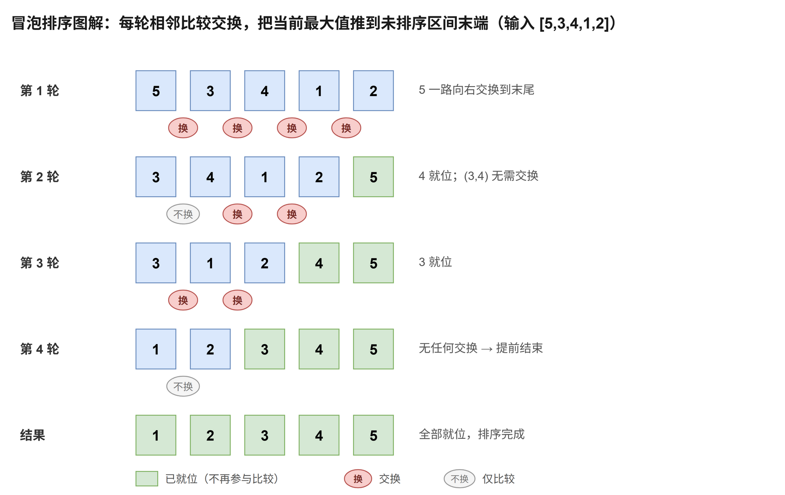

# 冒泡排序

[返回十大排序目录](../index.md) · [建议学习路径](../learning-path.md)

## 原理

从左到右比较相邻元素，前者更大时交换。一轮结束后，当前未排序区间的最大值位于右端；下一轮无需再访问已经确定的后缀。如果整轮没有交换，数组已经有序，可以结束。

算法定义可参考 [NIST：冒泡排序](https://xlinux.nist.gov/dads/HTML/bubblesort.html)。以下模板和演示用于逐步理解实现，复杂度按本页给出的版本分析。

**循环 / 递归不变量：**内层循环扫描到 j 后，区间 [0, j] 的最大值处于 j；外层循环结束一轮后，右侧后缀已经有序且位置确定。

## 过程演示

| 步骤 | 数组 / 状态 |
| --- | --- |
| 初始 | [5,3,4,1,2] |
| 第一轮，5 到末尾 | [3,4,1,2,5] |
| 第二轮，4 就位 | [3,1,2,4,5] |
| 第三轮，3 就位 | [1,2,3,4,5] |
| 第四轮，无交换 | 提前结束 |

## 图解



## C++17 实现模板

函数接收整数数组并修改其结果。使用 int 下标的模板约定元素数不超过 INT_MAX。本专题的整数键按常见的 32 位 int 讨论；稳定性指比较相同键时，附属记录仍保持原相对顺序。

```cpp
#include <utility>  // std::swap
#include <vector>

void bubbleSort(std::vector<int>& a) {
    const int n = static_cast<int>(a.size());  // 元素个数；空数组时循环自然不执行
    // end 是未排序区间的右边界（不含 end）。每完成一轮，区间最大值落在 end - 1，边界左移一格。
    for (int end = n; end > 1; --end) {
        bool changed = false;                  // 每轮开始都要重置：记录本轮是否发生过交换
        for (int j = 1; j < end; ++j) {        // 内层只扫到 end - 1，访问 a[j - 1]、a[j] 不会越界
            if (a[j - 1] > a[j]) {             // 严格大于才交换：相等元素不越过彼此，这是稳定性的来源
                std::swap(a[j - 1], a[j]);     // 把较大的元素向右冒泡一格
                changed = true;
            }
        }
        if (!changed) break;                   // 整轮无交换说明已完全有序，提前结束
    }
}
```

end 是未排序区间的右边界，不包含 end。只交换严格逆序的相邻元素，所以相等元素不会越过彼此。changed 必须在每一轮开始时重新设为 false。

## 性质与复杂度

| 性质 | 本模板 |
| --- | --- |
| 时间 | 最好 O(n)；平均 / 最坏 O(n²) |
| 额外空间 | O(1) |
| 稳定性 | 稳定 |
| 原地性 | 是 |

已有序输入只需一轮检查。逆序输入需要约 n(n - 1)/2 次比较和交换；随机输入平均也为二次时间。稳定性来自“相等时不交换”，额外状态只有循环变量。

## 练习题单

“基础 / 核心”练习当前算法或主要操作；“延伸 / 进阶”借用相关思想，不表示该题必须使用完整排序。

| 题目 | 定位 | 练习重点 |
| --- | --- | --- |
| [912. 排序数组](./912.md) | 基础 | 小数组手写模板并记录每轮交换；完整数据不使用二次算法。 |
| [283. 移动零](./283.md) | 延伸 | 理解稳定移动，再改用 O(n) 双指针移动零。 |

### 手写练习

给元素附上原下标，如 (2,a)、(1,b)、(2,c)，只比较数值，检查排序后两个 2 的顺序。再统计有序、逆序数组的比较与交换次数。

## 易错点

- 把交换条件写成 >= 会破坏稳定性。
- 忘记重置 changed，提前结束就失效。
- 右边界应逐轮缩小；内层访问 j - 1、j 时不能越界。
- 提前结束只能改善部分输入，不能把最坏时间变成 O(n log n)。
