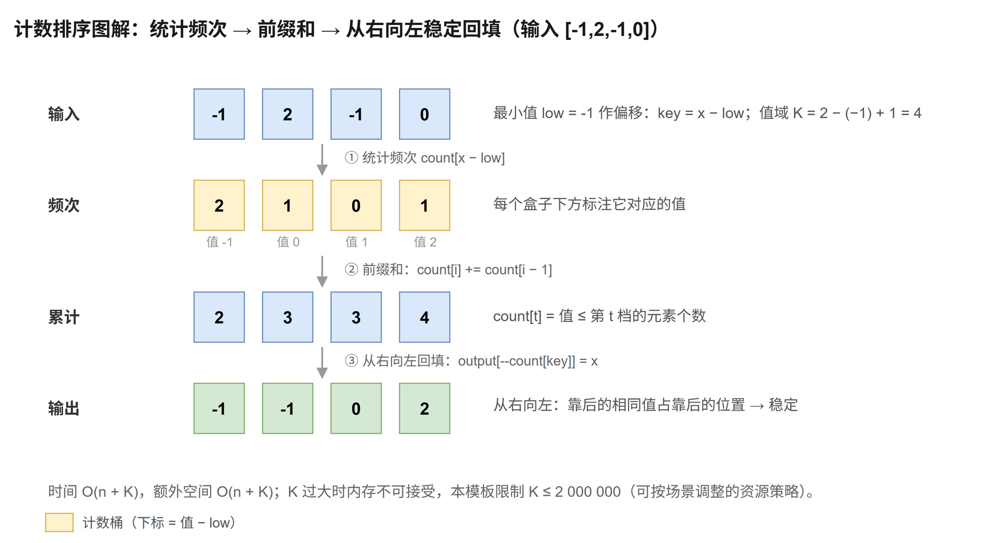

# 计数排序

[返回十大排序目录](../index.md) · [建议学习路径](../learning-path.md)

## 原理

当整数值域较小时，统计每种值的次数，构造累计计数，再把元素放到输出数组的对应位置。这里用最小值作为偏移支持负数，K = 最大值 - 最小值 + 1。

算法定义可参考 [NIST：计数排序](https://xlinux.nist.gov/dads/HTML/countingsort.html)。以下模板和演示用于逐步理解实现，复杂度按本页给出的版本分析。

**循环 / 递归不变量：**累计计数 count[t] 表示不大于第 t 种值的元素数。放置一个元素时，先减去对应计数，就得到它当前可占据的最后位置。

## 过程演示

| 步骤 | 数组 / 状态 |
| --- | --- |
| 输入与偏移 | [-1,2,-1,0]，最小值为 -1 |
| 对应值域 | [-1,0,1,2] |
| 频次 | [2,1,0,1] |
| 累计计数 | [2,3,3,4] |
| 从右向左放入输出 | [-1,-1,0,2] |

## 图解



## C++17 实现模板

函数接收整数数组并修改其结果。计数与输出下标使用 std::size_t。本专题的整数键按常见的 32 位 int 讨论；稳定性指比较相同键时，附属记录仍保持原相对顺序。

```cpp
#include <algorithm>   // std::minmax_element
#include <cstddef>     // std::size_t
#include <stdexcept>   // std::length_error
#include <vector>

void countingSort(std::vector<int>& a) {
    if (a.empty()) return;
    const auto bounds = std::minmax_element(a.begin(), a.end()); // 一次扫描同时拿到最小值和最大值
    const long long low = *bounds.first;                         // 最小值作偏移，让负数也映射到从 0 起的下标
    const long long range = static_cast<long long>(*bounds.second) - low + 1; // 值域长度 K；先转 long long 再相减，避免差值溢出
    // 资源策略：值域超过两百万就拒绝分配，防止内存爆炸；这不是计数排序的理论限制。
    if (range > 2'000'000) throw std::length_error("counting sort range too large");
    std::vector<std::size_t> count(static_cast<std::size_t>(range), 0);
    for (int x : a) ++count[static_cast<std::size_t>(static_cast<long long>(x) - low)]; // ① 统计每个值出现的次数
    for (std::size_t i = 1; i < count.size(); ++i) count[i] += count[i - 1];            // ② 前缀和：count[t] = 值 ≤ 第 t 档的元素数
    std::vector<int> output(a.size());
    for (std::size_t i = a.size(); i > 0; --i) {  // ③ 从右向左遍历：靠后的相同值占靠后的位置，保证稳定
        const int x = a[i - 1];
        const std::size_t key = static_cast<std::size_t>(static_cast<long long>(x) - low); // 偏移后的计数下标
        output[--count[key]] = x;                 // 先自减再使用：得到该值当前应占的最后一个位置
    }
    a.swap(output);                               // O(1) 交换写回，不做逐元素拷贝
}
```

累计计数配合从右向左遍历保证稳定：原来靠后的相同值占靠后的输出位置。先转 long long 再求差，避免 int 值域差溢出。两百万上限是本示例的资源策略，可以按场景调整；它不是计数排序的理论限制。

## 性质与复杂度

| 性质 | 本模板 |
| --- | --- |
| 时间 | O(n + K)，K 为值域长度 |
| 额外空间 | O(n + K) |
| 稳定性 | 本模板稳定 |
| 原地性 | 否 |

扫描输入、累计计数和回填共 O(n + K)，临时输出与计数数组合计 O(n + K)。只有 K 合理时才适用；元素少而值域很宽时，内存可能远大于输入。逐值输出频次也能排序整数，但若元素携带其他字段，应使用这里的稳定放置方式。

## 练习题单

“基础 / 核心”练习当前算法或主要操作；“延伸 / 进阶”借用相关思想，不表示该题必须使用完整排序。

| 题目 | 定位 | 练习重点 |
| --- | --- | --- |
| [912. 排序数组](./912.md) | 核心 | 检查值域，再使用偏移计数；不适用于任意稀疏大值域。 |
| [75. 颜色分类](./75.md) | 基础 | 只有三种颜色，比较计数回填与原地三路划分。 |
| [1122. 数组的相对排序](./1122.md) | 延伸 | 先按指定顺序消耗计数，再输出剩余值。 |
| [1051. 高度检查器](./1051.md) | 基础 | 生成预期顺序并与原位置比较。 |
| [274. H 指数](./274.md) | 延伸 | 把引用次数截到论文数，再累计高频桶。 |
| [1365. 有多少小于当前数字的数字](./1365.md) | 延伸 | 前缀计数回答严格小于某个值的数量。 |
| [242. 有效的字母异位词](./242.md) | 延伸 | 只比较字符频次，无需输出排序结果。 |

### 手写练习

把输入改成 (整数键, 原下标) 并把整个记录放入 output，验证相等键的下标递增。测试负数、全相等值，以及被值域上限拒绝的稀疏输入。

## 易错点

- K 是最大值与最小值之差加一，不是不同值的数量。
- 先在 int 中相减再转 long long，仍然会溢出。
- 累计计数的稳定回填方向不能随意反转。
- 稳定输出需要额外数组，本模板不是 O(K) 空间或原地排序。
