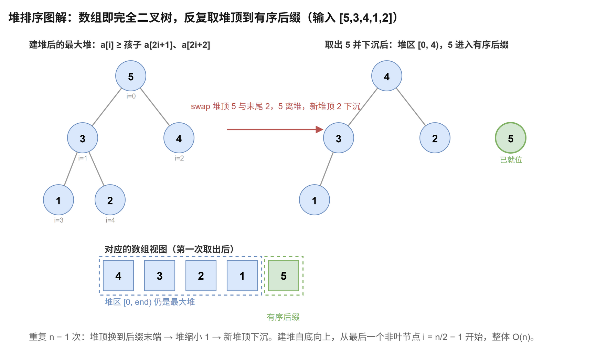

# 堆排序

[返回十大排序目录](../index.md) · [建议学习路径](../learning-path.md)

## 原理

先把数组建成最大堆，堆顶就是当前最大值。将堆顶与未排序区间的末尾交换，缩小堆，再让新堆顶下沉恢复最大堆性质。重复后，有序后缀逐步扩大。

算法定义可参考 [NIST：堆排序](https://xlinux.nist.gov/dads/HTML/heapSort.html)。以下模板和演示用于逐步理解实现，复杂度按本页给出的版本分析。

**循环 / 递归不变量：**[0, end) 是最大堆，[end, n) 是已排好的升序后缀，其中每个元素都不小于堆内元素。

## 过程演示

| 步骤 | 数组 / 状态 |
| --- | --- |
| 初始数组已经是最大堆 | [5,3,4,1,2] |
| 取出 5，恢复堆 | [4,3,2,1] / [5] |
| 取出 4，恢复堆 | [3,1,2] / [4,5] |
| 取出 3，恢复堆 | [2,1] / [3,4,5] |
| 取出 2 | [1,2,3,4,5] |

## 图解



## C++17 实现模板

函数接收整数数组并修改其结果。使用 int 下标的模板约定元素数不超过 INT_MAX。本专题的整数键按常见的 32 位 int 讨论；稳定性指比较相同键时，附属记录仍保持原相对顺序。

```cpp
#include <utility>  // std::swap
#include <vector>

void heapSort(std::vector<int>& a) {
    const int n = static_cast<int>(a.size());
    // 下沉：把 a[root] 调整到堆 [0, size) 内的正确位置。
    auto siftDown = [&](int root, int size) {
        // 非叶节点下标为 [0, size / 2)；叶节点没有孩子，无需下沉。
        while (root < size / 2) {
            int child = root * 2 + 1;                                // 左孩子下标 2i + 1
            if (child + 1 < size && a[child + 1] > a[child]) ++child; // 右孩子存在且更大时选右孩子
            if (a[root] >= a[child]) break;                          // 已满足最大堆性质，提前结束
            std::swap(a[root], a[child]);                            // 与较大的孩子交换，继续向下检查
            root = child;
        }
    };
    // 建堆：从最后一个非叶节点 i = n/2 - 1 倒序下沉，整体 O(n)。
    for (int i = n / 2; i > 0; --i) siftDown(i - 1, n);
    // 排序：不变量 [0, end) 是最大堆，[end, n) 是已就位的升序后缀。
    for (int end = n; end > 1;) {
        std::swap(a[0], a[--end]);               // 堆顶（当前最大值）换到后缀末端，同时堆缩小 1
        siftDown(0, end);                        // 新堆顶下沉，恢复 [0, end) 的最大堆性质
    }
}
```

0 起始下标的左右孩子为 2i + 1、2i + 2。每次选更大的孩子交换，否则不能保证最大堆。建堆从最后一个非叶节点向前下沉；取出最大值后，新 end 不属于堆。

## 性质与复杂度

| 性质 | 本模板 |
| --- | --- |
| 时间 | 平均 / 最坏 O(n log n)；建堆 O(n) |
| 额外空间 | O(1) |
| 稳定性 | 不稳定 |
| 原地性 | 是 |

自底向上建堆为 O(n)，不是将 n 个元素逐个插入的 O(n log n)。每次取出堆顶最多 O(log n)，全部取出平均和最坏 O(n log n)。下沉可提前停止，特殊输入可能更快。迭代实现只用 O(1) 空间，远距离交换使其不稳定。

## 练习题单

“基础 / 核心”练习当前算法或主要操作；“延伸 / 进阶”借用相关思想，不表示该题必须使用完整排序。

| 题目 | 定位 | 练习重点 |
| --- | --- | --- |
| [912. 排序数组](./912.md) | 核心 | 手写最大堆与下沉，不调用内置排序。 |
| [215. 数组中的第 K 个最大元素](./215.md) | 延伸 | 保留 k 个最大值时使用容量 k 的最小堆。 |
| [347. 前 K 个高频元素](./347.md) | 延伸 | 按频率维护 Top K。 |
| [23. 合并 K 个升序链表](./23.md) | 延伸 | 最小堆保存每条链表当前头节点。 |
| [703. 数据流中的第 K 大元素](./703.md) | 延伸 | 把静态 Top K 扩展到数据流。 |
| [1046. 最后一块石头的重量](./1046.md) | 基础 | 反复取出两个最大值并把剩余重量放回堆。 |

### 手写练习

画出数组对应的完全二叉树。给每个非叶节点标出下沉距离，解释为什么各节点高度之和为 O(n)。

## 易错点

- 完整升序堆排序用最大堆；保留 k 个最大值通常用最小堆。
- 下沉时只与左孩子比较可能遗漏更大的右孩子。
- 堆大小缩小后不要访问已排序后缀。
- 直接弹堆生成另一数组与这里的 O(1) 原地模板不同。
