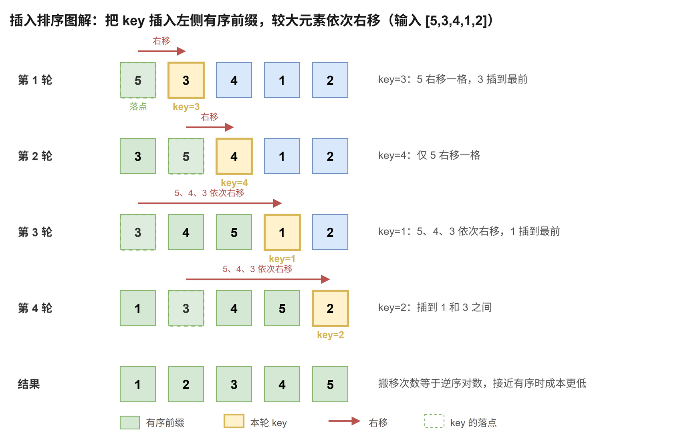

# 插入排序

[返回十大排序目录](../index.md) · [建议学习路径](../learning-path.md)

## 原理

把当前元素暂存为 key，从有序前缀的末尾向前寻找插入位置。所有比 key 大的元素右移一格，最后把 key 写进空位。

算法定义可参考 [NIST：插入排序](https://xlinux.nist.gov/dads/HTML/insertionSort.html)。以下模板和演示用于逐步理解实现，复杂度按本页给出的版本分析。

**循环 / 递归不变量：**开始第 i 轮时，[0, i) 已有序；完成插入后，[0, i + 1) 有序。

## 过程演示

| 步骤 | 数组 / 状态 |
| --- | --- |
| 初始 | [5,3,4,1,2] |
| 插入 3 | [3,5,4,1,2] |
| 插入 4 | [3,4,5,1,2] |
| 插入 1 | [1,3,4,5,2] |
| 插入 2 | [1,2,3,4,5] |

## 图解



## C++17 实现模板

函数接收整数数组并修改其结果。使用 int 下标的模板约定元素数不超过 INT_MAX。本专题的整数键按常见的 32 位 int 讨论；稳定性指比较相同键时，附属记录仍保持原相对顺序。

```cpp
#include <vector>

void insertionSort(std::vector<int>& a) {
    const int n = static_cast<int>(a.size());
    // 不变量：第 i 轮开始时，[0, i) 已有序。
    for (int i = 1; i < n; ++i) {              // 从第 2 个元素开始：单个元素天然有序
        const int key = a[i];                  // 先暂存待插入元素，防止右移时被覆盖
        int j = i;                             // j：key 的候选位置，从 i 起向左探测
        while (j > 0 && a[j - 1] > key) {      // 严格大于才右移：相等元素停在 key 前面，保证稳定
            a[j] = a[j - 1];                   // 比 key 大的元素整体向右挪一格
            --j;
        }
        a[j] = key;                            // 把 key 写进空出来的位置
    }
}
```

先保存 key，再开始搬移，避免被覆盖。条件使用 >，让新来的相同值插在已有相同值之后，因此保持稳定。

## 性质与复杂度

| 性质 | 本模板 |
| --- | --- |
| 时间 | 最好 O(n)；平均 / 最坏 O(n²) |
| 额外空间 | O(1) |
| 稳定性 | 稳定 |
| 原地性 | 是 |

有序输入每轮只检查前一个元素，总时间 O(n)。搬移次数等于数组的逆序对数，接近有序时通常成本较低；随机及逆序输入为二次时间。二分查找可以减少定位比较，却无法消除数组搬移。

## 练习题单

“基础 / 核心”练习当前算法或主要操作；“延伸 / 进阶”借用相关思想，不表示该题必须使用完整排序。

| 题目 | 定位 | 练习重点 |
| --- | --- | --- |
| [912. 排序数组](./912.md) | 基础 | 小数组实现插入排序；记录每次右移，不用于完整规模的二次解法。 |
| [147. 对链表进行插入排序](./147.md) | 核心 | 把数组搬移改成链表节点摘取与插入。 |
| [35. 搜索插入位置](./35.md) | 延伸 | 二分寻找插入位置；同时解释为何数组插入不是 O(log n)。 |

### 手写练习

把查找位置改成二分 upper_bound 的语义，使相同值插在已有相同值后面；记录比较次数和搬移次数的区别。

## 易错点

- 先搬移后保存 key 会丢失原值。
- 用无符号下标向左减可能发生下溢。
- 稳定插入应跳过已有的相等元素。
- 链表插入的改指针操作虽为 O(1)，寻找位置仍可能为 O(n)。
