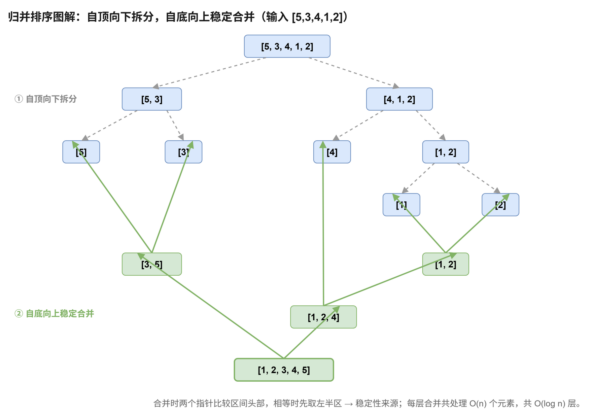

# 归并排序

[返回十大排序目录](../index.md) · [建议学习路径](../learning-path.md)

## 原理

把区间分为左右两半，分别排序，再用两个指针线性合并。每层所有合并处理共 O(n) 个元素，递归深度为 O(log n)。

算法定义可参考 [NIST：归并排序](https://xlinux.nist.gov/dads/HTML/mergesort.html)。以下模板和演示用于逐步理解实现，复杂度按本页给出的版本分析。

**循环 / 递归不变量：**合并时左右区间已经各自有序，输出前缀是它们目前未取元素中的最小若干个元素。

## 过程演示

| 步骤 | 数组 / 状态 |
| --- | --- |
| 初始拆分 | [5,3] 与 [4,1,2] |
| 左半区排序 | [3,5] |
| 右半区排序 | [1,2,4] |
| 比较两个区间头部并依次取出 | 1 → 2 → 3 → 4 → 5 |

## 图解



## C++17 实现模板

函数接收整数数组并修改其结果。使用 int 下标的模板约定元素数不超过 INT_MAX。本专题的整数键按常见的 32 位 int 讨论；稳定性指比较相同键时，附属记录仍保持原相对顺序。

```cpp
#include <vector>

void mergeSort(std::vector<int>& a) {
    const int n = static_cast<int>(a.size());
    std::vector<int> temp(a.size());           // 辅助数组只分配一次，各层递归复用
    // 递归排序左闭右开区间 [l, r)；长度不超过 1 时天然有序。
    auto solve = [&](auto&& self, int l, int r) -> void {
        if (r - l <= 1) return;
        const int mid = l + (r - l) / 2;       // 中点写成 l + (r - l) / 2，避免大下标相加溢出
        self(self, l, mid);                    // 先排好左半 [l, mid)
        self(self, mid, r);                    // 再排好右半 [mid, r)
        // 合并：i 扫左半，j 扫右半，k 指向 temp 的写入位置。
        int i = l, j = mid, k = l;
        while (i < mid && j < r) {
            // 相等时先取左边：相同值保持原有相对顺序，这是稳定性的来源。
            if (a[i] <= a[j]) temp[k++] = a[i++];
            else temp[k++] = a[j++];
        }
        while (i < mid) temp[k++] = a[i++];    // 两侧之一必已取空，把另一侧的剩余元素依次追加
        while (j < r) temp[k++] = a[j++];
        for (int p = l; p < r; ++p) a[p] = temp[p]; // 把合并结果写回原区间
    };
    solve(solve, 0, n);
}
```

区间统一采用左闭右开 [l, r)，终止条件是长度不超过 1。temp 只分配一次并在各层复用。右半区从 mid 开始，左半区到 mid 之前结束。

## 性质与复杂度

| 性质 | 本模板 |
| --- | --- |
| 时间 | 最好 / 平均 / 最坏 O(n log n) |
| 额外空间 | O(n) |
| 稳定性 | 稳定 |
| 原地性 | 否 |

本模板没有跳过已排序区间的优化，各类输入均为 O(n log n)。临时数组占 O(n)，递归栈占 O(log n)，合计 O(n)。相等时优先取左侧保证稳定。数组模板不是原地排序；链表归并可以通过重连节点减少空间。

## 练习题单

“基础 / 核心”练习当前算法或主要操作；“延伸 / 进阶”借用相关思想，不表示该题必须使用完整排序。

| 题目 | 定位 | 练习重点 |
| --- | --- | --- |
| [912. 排序数组](./912.md) | 核心 | 稳定数组归并，检查半开区间边界。 |
| [88. 合并两个有序数组](./88.md) | 基础 | 单次合并；原地写回时思考从后向前合并。 |
| [21. 合并两个有序链表](./21.md) | 基础 | 用节点连接替代临时数组。 |
| [148. 排序链表](./148.md) | 核心 | 排序链表；进阶改为自底向上迭代归并。 |
| [23. 合并 K 个升序链表](./23.md) | 延伸 | 两两合并 K 条有序链表，也可使用堆。 |
| [315. 计算右侧小于当前元素的个数](./315.md) | 进阶 | 合并时记录右侧更小元素数量，同时保留原下标。 |
| [493. 翻转对](./493.md) | 进阶 | 先统计左值大于两倍右值的跨区间对，再进行普通合并。 |
| [327. 区间和的个数](./327.md) | 进阶 | 前缀和配合两个单调边界统计范围内差值。 |

### 手写练习

将元素扩展为 (值, 原下标)，相等时仍从左侧取出，检查重复值的顺序。再尝试自底向上归并，比较递归栈需求。

## 易错点

- 把 [l, r) 与闭区间边界混用会遗漏或重复元素。
- 遗漏一侧剩余元素会丢失数据。
- 翻转对条件不同于普通逆序对，不能仅修改合并比较条件。
- 两倍数值、前缀和以及差值应先提升到足够宽的整数类型。
