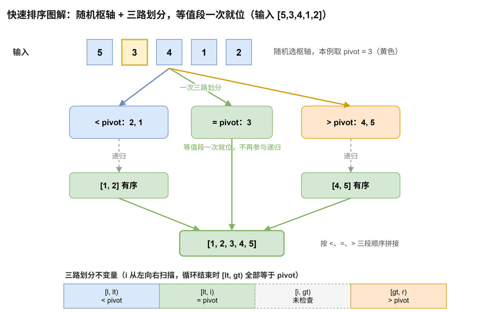

# 快速排序

[返回十大排序目录](../index.md) · [建议学习路径](../learning-path.md)

## 原理

选择一个枢轴值，把区间划分为小于、等于、大于枢轴的三段，再处理左右两段。本模板随机选枢轴并采用三路划分，让大量重复值一次就位。

算法定义可参考 [NIST：快速排序](https://xlinux.nist.gov/dads/HTML/quicksort.html)。以下模板和演示用于逐步理解实现，复杂度按本页给出的版本分析。

**循环 / 递归不变量：**划分时 [l, lt) 小于枢轴，[lt, i) 等于枢轴，[i, gt) 尚未检查，[gt, r) 大于枢轴。

## 过程演示

| 步骤 | 数组 / 状态 |
| --- | --- |
| 初始，本例固定选 3 演示 | [5,3,4,1,2] |
| 三路划分完成 | [2,1] / [3] / [4,5] |
| 分别处理两侧 | [1,2] / [3] / [4,5] |
| 结果 | [1,2,3,4,5] |

## 图解



## C++17 实现模板

函数接收整数数组并修改其结果。使用 int 下标的模板约定元素数不超过 INT_MAX。本专题的整数键按常见的 32 位 int 讨论；稳定性指比较相同键时，附属记录仍保持原相对顺序。

```cpp
#include <random>    // std::mt19937、std::uniform_int_distribution
#include <utility>   // std::swap
#include <vector>

void quickSort(std::vector<int>& a) {
    std::mt19937 rng(std::random_device{}());  // 随机源：打散输入模式，避免固定枢轴被构造退化
    // 处理区间 [l, r)；只有较小的一侧递归，较大的一侧留在 while 里继续，栈深保证 O(log n)。
    auto solve = [&](auto&& self, int l, int r) -> void {
        while (r - l > 1) {                    // 区间长度不超过 1 时天然有序
            std::uniform_int_distribution<int> pick(l, r - 1);
            const int pivot = a[pick(rng)];    // 关键：保存枢轴的值；若记录下标，随后的交换会让它失效
            // 三路划分不变量：[l, lt) < pivot；[lt, i) = pivot；[i, gt) 未检查；[gt, r) > pivot。
            int lt = l, i = l, gt = r;
            while (i < gt) {
                if (a[i] < pivot) std::swap(a[lt++], a[i++]);    // 换到等值区左端，换来的元素已检查，i 前进
                else if (a[i] > pivot) std::swap(a[i], a[--gt]); // 换来的是未检查元素，i 不动
                else ++i;                                        // 等于枢轴：扩入等值区
            }
            // 等值区间 [lt, gt) 已全部就位，无需参与递归。
            if (lt - l < r - gt) {
                self(self, l, lt);               // 只递归较小的一侧
                l = gt;                          // 较大的一侧交给 while 继续处理
            } else {
                self(self, gt, r);
                r = lt;
            }
        }
    };
    solve(solve, 0, static_cast<int>(a.size()));
}
```

从右侧交换来的元素还没有检查，因此大于 pivot 分支不增加 i。等值区间无需递归。每次只递归较小侧，递归区间至少减半，调用栈保证 O(log n)；较大侧继续用 while 处理。随机代码的实际枢轴可能与演示不同。

## 性质与复杂度

| 性质 | 本模板 |
| --- | --- |
| 时间 | 期望 O(n log n)；最坏 O(n²) |
| 额外空间 | 本模板 O(log n) 调用栈 |
| 稳定性 | 不稳定 |
| 原地性 | 分区原地；有调用栈 |

随机枢轴使期望时间为 O(n log n)，但仍可能连续选到极端枢轴而达到 O(n²)。所有值相等时三路划分只做一轮，时间 O(n)。普通双侧递归快排可能需要最坏 O(n) 栈；本模板的较小侧递归保证 O(log n) 栈。交换分区不保持相等值顺序。

## 练习题单

“基础 / 核心”练习当前算法或主要操作；“延伸 / 进阶”借用相关思想，不表示该题必须使用完整排序。

| 题目 | 定位 | 练习重点 |
| --- | --- | --- |
| [912. 排序数组](./912.md) | 核心 | 随机三路快排，重点验证大量重复元素。 |
| [75. 颜色分类](./75.md) | 基础 | 把枢轴等值划分改成 0、1、2 三类区域。 |
| [215. 数组中的第 K 个最大元素](./215.md) | 延伸 | 快速选择只进入包含目标名次的一侧，期望线性时间。 |
| [973. 最接近原点的 K 个点](./973.md) | 延伸 | 按距离平方划分，仅保留所需的 k 个点。 |
| [324. 摆动排序 II](./324.md) | 进阶 | 中位数、三路划分与虚拟下标配合处理重复值。 |

### 手写练习

输入全相等、已排序、逆序和重复值很多的数组。对比双路与三路划分的轮数，并说明随机化不等于最坏时间保证。

## 易错点

- pivot 必须保存数值，不能一直引用可能被交换的位置。
- 大于枢轴的分支交换后立即 ++i 会跳过未知元素。
- 递归应跳过等值段，否则全相等输入也可能退化。
- 点的距离平方、中间乘积按题目值域使用宽整数。
