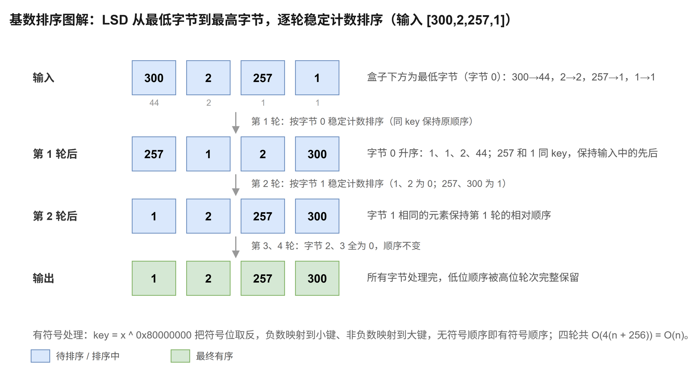

# 基数排序

[返回十大排序目录](../index.md) · [建议学习路径](../learning-path.md)

## 原理

低位优先基数排序（LSD）从最低位到最高位，逐轮按当前位做稳定排序。稳定性保留此前低位的顺序，因此完成所有位后得到完整顺序。这里每轮处理一个字节，而不是一个十进制位。

算法定义可参考 [NIST：基数排序](https://xlinux.nist.gov/dads/HTML/radixsort.html)。以下模板和演示用于逐步理解实现，复杂度按本页给出的版本分析。

**循环 / 递归不变量：**处理完最低的 t 个字节后，数组按转换后的键的低 8t 位有序；下一轮稳定排序不打乱当前字节相同元素的低位顺序。

## 过程演示

| 步骤 | 数组 / 状态 |
| --- | --- |
| 输入 | [300,2,257,1] |
| 最低字节分别为 44、2、1、1 | [257,1,2,300] |
| 第二字节排序，保留同字节内原顺序 | [1,2,257,300] |
| 第三、第四字节继续稳定排序 | [1,2,257,300] |

## 图解



## C++17 实现模板

函数接收整数数组并修改其结果。计数与输出下标使用 std::size_t。本专题的整数键按常见的 32 位 int 讨论；稳定性指比较相同键时，附属记录仍保持原相对顺序。

```cpp
#include <array>
#include <cstddef>     // std::size_t
#include <cstdint>     // std::uint32_t
#include <limits>
#include <vector>

void radixSort(std::vector<int>& a) {
    static_assert(std::numeric_limits<int>::digits == 31, "requires 32-bit int"); // 本模板按 4 轮、每轮 8 位分析
    std::vector<int> output(a.size());            // 每轮的稳定输出缓冲，与 a 交替使用
    for (int shift = 0; shift < 32; shift += 8) { // 依次处理字节 0、1、2、3（低位优先 LSD）
        std::array<std::size_t, 256> count{};     // 256 个计数桶，覆盖一个字节的全部取值
        auto digit = [shift](int x) -> std::size_t {
            // 异或最高位：负数（符号位 1）映射到小键，非负数映射到大键，
            // 无符号键的顺序就与有符号 int 的顺序一致。
            const std::uint32_t key = static_cast<std::uint32_t>(x) ^ 0x80000000u;
            return (key >> shift) & 255u;         // 取从第 shift 位起的 8 位作为本轮键
        };
        for (int x : a) ++count[digit(x)];        // ① 统计本字节各取值的频次
        for (std::size_t i = 1; i < count.size(); ++i) count[i] += count[i - 1]; // ② 前缀和
        for (std::size_t i = a.size(); i > 0; --i) { // ③ 从右向左回填：相同字节保持原有顺序（稳定）
            const int x = a[i - 1];
            output[--count[digit(x)]] = x;
        }
        a.swap(output);                           // O(1) 交换；下轮会覆盖 output 全部位置，四轮共用这组数组
    }
}
```

int 转为 uint32_t 后异或最高位，将负数映射到较小键、非负数映射到较大键，键的无符号顺序等于原有符号整数顺序。每轮从右向左计数回填保持稳定。output 和 a 交换后，下轮会覆盖 output 全部位置，四轮使用同一组数组。

## 性质与复杂度

| 性质 | 本模板 |
| --- | --- |
| 时间 | O(d(n + b))；本模板 d = 4、b = 256 |
| 额外空间 | O(n + b) |
| 稳定性 | 稳定 |
| 原地性 | 否 |

一般分析是 d 轮，每轮扫描 n 个元素并累计 b 个计数，即 O(d(n + b))，空间 O(n + b)。这里限制 32 位 int，d = 4、b = 256 为常数，时间可写为 O(n)。若数字位数随输入增大，必须保留 d。每轮稳定才能保证低位优先排序正确。

## 练习题单

“基础 / 核心”练习当前算法或主要操作；“延伸 / 进阶”借用相关思想，不表示该题必须使用完整排序。

| 题目 | 定位 | 练习重点 |
| --- | --- | --- |
| [912. 排序数组](./912.md) | 核心 | 按字节处理有符号 int，覆盖负数和极值。 |
| [164. 最大间距](./164.md) | 延伸 | 固定位宽基数排序后扫描相邻差，满足线性时间。 |
| [2343. 裁剪数字后查询第 K 小的数字](./2343.md) | 进阶 | 数字字符串逐位稳定排序，按裁剪长度回答查询并保留下标平局规则。 |

### 手写练习

先用十进制数字手算 LSD 过程，再对照本模板按 256 进制手算。输入 INT_MIN、-1、0、INT_MAX，观察最高位异或后的无符号键顺序。

## 易错点

- 某一轮使用不稳定排序，会丢掉低位已经建立的顺序。
- 直接按有符号数的原始字节做无符号排序会把负数放在后面。
- 对 INT_MIN 求 abs 或取负可能溢出，本模板无需这些操作。
- 字符串数字可能有前导零或超出整数范围，保留字符串与原下标处理。
