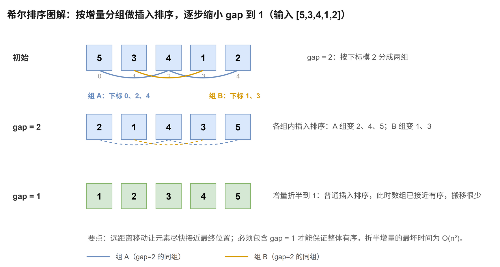

# 希尔排序

[返回十大排序目录](../index.md) · [建议学习路径](../learning-path.md)

## 原理

先按较大间隔 gap 做分组插入排序，让元素跨越较远距离移动；逐步缩小 gap，最后 gap = 1 完成普通插入排序。这里使用 n/2、n/4、…、1 的折半增量。

算法定义可参考 [NIST：希尔排序](https://xlinux.nist.gov/dads/HTML/shellsort.html)。以下模板和演示用于逐步理解实现，复杂度按本页给出的版本分析。

**循环 / 递归不变量：**完成一个 gap 后，每个下标模 gap 相同的子序列都有序；gap = 1 后整个数组有序。

## 过程演示

| 步骤 | 数组 / 状态 |
| --- | --- |
| 初始 | [5,3,4,1,2] |
| gap = 2：下标 0、2、4 组变为 2、4、5；1、3 组变为 1、3 | [2,1,4,3,5] |
| gap = 1：普通插入排序 | [1,2,3,4,5] |

## 图解



## C++17 实现模板

函数接收整数数组并修改其结果。使用 int 下标的模板约定元素数不超过 INT_MAX。本专题的整数键按常见的 32 位 int 讨论；稳定性指比较相同键时，附属记录仍保持原相对顺序。

```cpp
#include <vector>

void shellSort(std::vector<int>& a) {
    const int n = static_cast<int>(a.size());
    // 外层：增量序列 n/2, n/4, ..., 1。gap = 1 那一轮就是普通插入排序，保证整体有序。
    for (int gap = n / 2; gap > 0; gap /= 2) {
        // 内层：对每个下标 i，把它插入到“下标模 gap 同组”的有序子序列里。
        for (int i = gap; i < n; ++i) {        // i 是各分组里从第二个元素开始的对象
            const int key = a[i];              // 先暂存，防止组内右移时被覆盖
            int j = i;                         // j：key 在组内的候选位置
            while (j >= gap && a[j - gap] > key) { // 与同组前一个元素比较；j >= gap 才能访问 a[j - gap]
                a[j] = a[j - gap];             // 组内元素按步长 gap 右移
                j -= gap;                      // 在同一组内向左跨一步（不是 --j）
            }
            a[j] = key;                        // 插入到组内的正确位置
        }
    }
}
```

j 每次减 gap，右移的也是同一组内元素。代码在 gap = 1 后继续除以 2 得到 0，循环终止；空数组和单元素数组不进入循环。

## 性质与复杂度

| 性质 | 本模板 |
| --- | --- |
| 时间 | 与增量有关；本模板最坏 O(n²) |
| 额外空间 | O(1) |
| 稳定性 | 不稳定 |
| 原地性 | 是 |

时间复杂度依赖增量序列，不能统一写成 O(n log n)。本模板折半增量的最坏时间为 O(n²)，有序输入需 O(n log n) 扫描；平均表现取决于输入分布。不同增量的理论结论不能直接套用。组内严格比较并不足以保证整体稳定，因为跨组移动可能改变相等值的顺序。

## 练习题单

“基础 / 核心”练习当前算法或主要操作；“延伸 / 进阶”借用相关思想，不表示该题必须使用完整排序。

| 题目 | 定位 | 练习重点 |
| --- | --- | --- |
| [912. 排序数组](./912.md) | 基础 | 小规模练习分组过程；本增量不能保证完整题面的 O(n log n)。 |

### 手写练习

分别实现折半增量和 1、4、13、40、… 增量，比较随机、有序和逆序输入的比较次数。先理解增量，再分析它的代价。

## 易错点

- 必须出现 gap = 1，否则组内有序不能推出整体有序。
- 把 j -= gap 写成 --j 会破坏分组插入。
- 检查 j >= gap 后才能访问 a[j - gap]。
- 分析复杂度必须注明增量，不要把另一种增量的上界写给当前模板。
