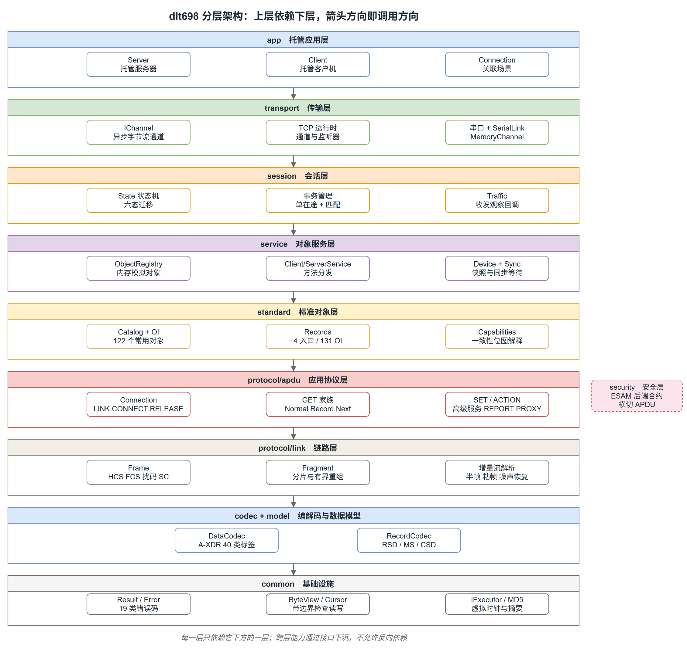
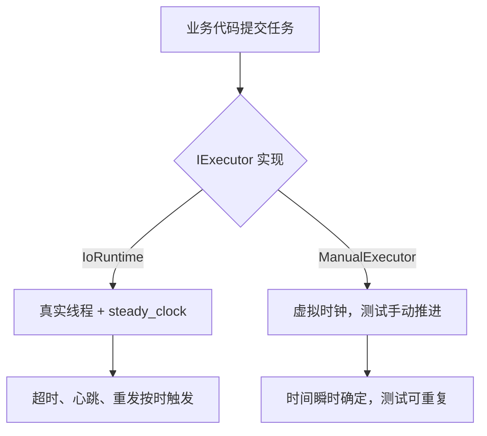
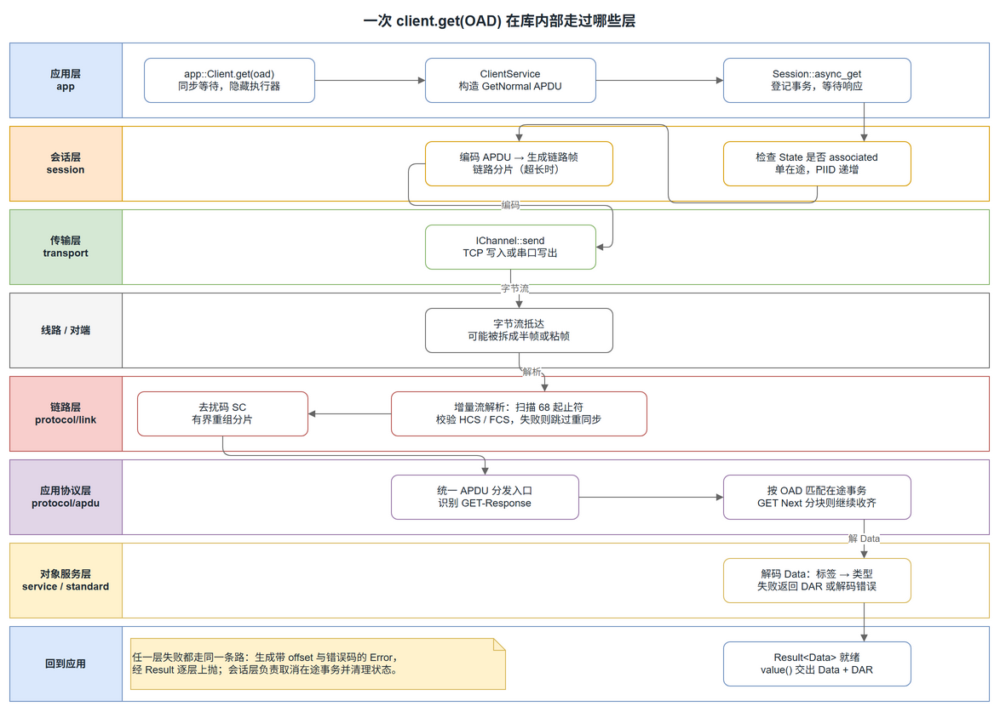

# 整体架构

dlt698 的模块划分只有一条原则：**每一层只依赖它下方的一层**。跨层能力通过接口下沉，绝不允许反向依赖。



## 九个层次

自下往上读，每一层只回答一个问题：

| 层 | 回答的问题 | 主要类型 |
| --- | --- | --- |
| `common` | 错误怎么表达，字节怎么安全读写？ | `Result<T>`、`Error`、`ByteView`、`IExecutor` |
| `codec` + `model` | 协议里的数据长什么样？ | `Data`、`Value<Tag, T>`、`DataCodec`、`RecordCodec` |
| `protocol/link` | 字节流怎么变成一帧？ | `Frame`、`crc16`、`LinkFragmenter`、`LinkReassembler` |
| `protocol/apdu` | 一帧里面装的是什么服务？ | `GetNormal`、`SetNormal`、`ActionNormal`、`ConnectRequest` |
| `standard` | 标准里的对象和点位怎么定义？ | `catalog`、`oi` 常量、记录模板、`Capabilities` |
| `service` | 谁真正持有数据、响应服务？ | `ObjectRegistry`、`ClientService`、`ServerService`、`Device` |
| `session` | 一次请求和它的响应怎么配对？ | `Session`、`State`、事务表 |
| `transport` | 字节从哪来、到哪去？ | `IChannel`、`TcpListener`、`SerialLinkChannel`、`MemoryChannel` |
| `app` | 我只想简单读一个点，还要写多少代码？ | `app::Server`、`app::Client` |

这个顺序回答了一个关键问题：**为什么 `session` 在 `service` 之上**。

因为会话只管「请求和响应的配对」，不关心数据从哪来。数据是 `service` 层的事。反过来，`service` 需要知道响应什么时候算完成，那是 `session` 提供的能力。这种「协议编解码不知道对象，对象不知道会话」的解耦，让内存通道上的服务端和真实 TCP 上的服务端可以共用同一套对象逻辑。

## 三个值得单独说的设计

### 1. Value 把 C++ 类型绑定到协议标签

这是 `model` 层最重要的一个决定：

```cpp
template <DataType Tag, class T>
struct Value {
    // 存储值与协议标签绑定
};
```

协议里 `UInt16`（无符号 16 位）和 `LongUnsigned`（长无符号）都是 2 字节，但语义完全不同。如果都用裸 `uint16_t` 表示，传错了编译器不会报错，运行时排查极其痛苦。

把标签绑进类型，`Value<DataType::uint16, std::uint16_t>` 和 `Value<DataType::long_unsigned, std::uint32_t>` 就是两个不可混淆的类型。**把运行期错误提前到编译期**，这是整个库里性价比最高的一个决定。

### 2. 字节视图默认不拥有内存

```cpp
class ByteView {
    ByteView(Bytes&&) = delete;              // 禁止借用临时容器
    ByteView(const Bytes&&) = delete;
};
```

`ByteView` 只借用连续内存。头文件里显式删除了右值构造，因为一旦允许，调用方写出 `ByteView make_view() { return ByteView(BuildBuffer()); }` 就会立刻悬空。

对解析器来说这是必须的能力——解析时不应该反复拷贝字节。但借用视图的代价就是生命周期风险，所以用删除重载把这个坑从根上堵死。

### 3. 虚拟时钟让时间相关逻辑可测

会话层有超时、心跳、重发，这些逻辑如果依赖真实时间，测试要么睡几秒要么不稳定。`IExecutor` 抽出执行器接口，`ManualExecutor` 提供可手动推进的单调时钟：



同一套会话代码，在生产走真实线程，在测试走虚拟时钟。这是 `session` 层能写出确定性测试的前提。

## 一次 GET 请求的完整路径

理解了分层，再跟一次请求走完全程。图里左侧是发起的应用，右侧是回传的路径：



几个关键点：

**发送侧的第 1 步是状态检查，不是编码。** `Session::async_get` 先确认当前是 `associated` 状态，再登记事务并递增 PIID。未关联就发出去，对端只会返回一个 LINK 错误，然后还要走一轮重新登录。**在错误的状态下拒绝请求，比发出去再失败便宜得多。**

**链路层对「半帧、粘帧、噪声」的处理是显式的。** 真实的 TCP 字节流不保证一帧对齐，`FrameParser` 增量扫描 `0x68` 起止符，HCS / FCS 校验失败就跳过继续同步。它不假设任何帧边界。

**分片重组与 APDU 解码是两件事。** 链路层只负责把碎片拼成完整的 APDU 字节，它不认识里面是什么服务。这种隔离让长响应（比如上千行的记录）能被链路层有界重组，而不用 APDU 层参与。

**事务匹配在 APDU 层完成。** 拿到 `GET-Response` 后按 OAD 匹配在途事务。若结果是 `GetNext`，会话层继续接收后续分块直到收齐，这个循环对调用方是透明的。

## 错误如何向上传递

统一用 `Result<T>`，不允许抛异常跨越层边界。


`Error` 有四个字段：错误分类 `ErrorCode`、出错位置 `offset`、字段名或传输层描述 `context`、以及远端 ERROR-Response 的原始码 `remote_code`。

19 个错误码里有两个专门为流解析设计：`need_more_data` 表示「数据不够，等更多」，这是增量解析能工作的前提——它和「解析失败」必须是两回事。

```cpp
enum class ErrorCode {
    need_more_data, invalid_length, invalid_value, unsupported_tag,
    unsupported_service, checksum_header, checksum_frame, resource_limit,
    trailing_data, closed, io_error, timeout, cancelled, busy,
    address_mismatch, direction_mismatch, not_associated,
    association_failed, remote_error,
};
```

带 `offset` 是另一个实用设计。联调时收到一个报错，能直接定位到第几个字节出的问题，而不是「解码失败」三个字了事。

## 关闭传输后还剩什么

`transport` 是唯一可选的一层：

```sh
cmake -S . -B build -DDLT698_BUILD_TRANSPORT=OFF
```

关掉之后，TCP 和串口不可用，但**内存通道、`SerialLinkChannel`、会话、同步 / 异步服务全部照常**。

这个开关的价值在测试：大部分协议逻辑的测试都跑在 `MemoryChannel` 上，根本不需要真实 socket。`transport_tcp` 和 `app` 这两个测试可执行文件才需要真实回环 socket，它们带 `network` 标签，可以单独筛出来跑。

## 模块索引

| 模块 | 一句话 | 深入阅读 |
| --- | --- | --- |
| 基础设施 | Result、字节视图、虚拟时钟 | [编解码层](./modules/codec.mdx) |
| 编解码与模型 | A-XDR、Data 标签、记录选择器 | [编解码层](./modules/codec.mdx) |
| 链路 | 帧、HCS / FCS、扰码、分片重组 | [链路层](./modules/link.mdx) |
| 应用协议 | 17 类 APDU 的编解码与分发 | [应用层 APDU](./modules/apdu.mdx) |
| 会话 | 六态状态机、单在途事务、超时 | [会话层](./modules/session.mdx) |
| 对象服务 | 对象目录、标准点位、快照 | [对象服务层](./modules/service.mdx) |
| 标准对象 | OI 常量、记录模板、能力协商 | [标准对象](./modules/standard.mdx) |
| 传输 | TCP、串口、内存通道 | [传输层](./modules/transport.mdx) |
| 托管应用 | 三行代码起一个服务端 | [托管应用层](./modules/app.mdx) |
| 安全 | ESAM 后端合约 | [安全层](./modules/security.mdx) |