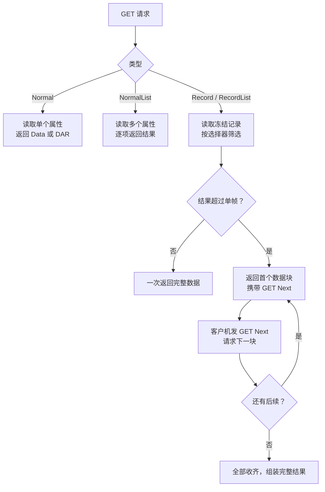

# 应用层 APDU

APDU 层回答的问题是：**一个链路帧的 payload 里，装的是什么服务？**

dlt698 在这一层实现了规约定义的 17 类服务，并给出一个统一分发入口。

## 服务清单

| 服务 | 能力 | 说明 |
| --- | :---: | --- |
| LINK | ✅ | 自动周期心跳、TimeTag 校验 |
| CONNECT | ✅ | 公共认证及可注入 ESAM 认证后端 |
| RELEASE | ✅ | 含 Notification |
| GET Normal / NormalList | ✅ | 逐项 Data / DAR |
| GET Record / RecordList | ✅ | 完整记录选择器 |
| GET Next | ✅ | 按行拆分收齐 |
| SET Normal / NormalList | ✅ | 精确 OAD 匹配 |
| ACTION 普通 / 列表 | ✅ | 完整 OMD 模式匹配 |
| ERROR | ✅ | 远端原码与 TimeTag 回显 |
| REPORT | ✅ | 三类通知/确认、有限重发 |
| PROXY | ✅ | 七类代理、路由及端口 provider |
| SECURITY | ✅ | 外层 codec / 后端状态机 |
| FollowReport / ACD | ✅ | 跟随结果及业务观察回调 |
| ThenGetNormalList | ✅ | 依次执行、单调延时、独立读取结果 |
| MD5 | ✅ | 完整 Data 编码的一致性摘要 |

## 统一分发入口

这是这一层最重要的抽象：

```cpp
DLT698_API Result<Apdu> decode_apdu(ByteView bytes, const Limits& limits = {});
DLT698_API Result<Bytes> encode_apdu(const Apdu& message, const Limits& limits = {});
DLT698_API unsigned advanced_capability(const Apdu& message);
DLT698_API bool advanced_matches(const Apdu& request, const Apdu& response);
```

`Apdu` 是一个变体，覆盖所有已支持的服务。收到一个字节块，调用 `decode_apdu` 就得到具体类型的 APDU 对象；反过来 `encode_apdu` 编回去。

**为什么用统一入口而不是每类服务各一个函数？** 因为链路层不该知道 payload 里是什么。它只管把字节交给上层，那么「上层怎么解释」就该有一个统一答案。分层在这里必须收口，否则每加一类服务都要改链路层。

## 高级服务的两个辅助函数

```cpp
unsigned advanced_capability(const Apdu& message);
bool advanced_matches(const Apdu& request, const Apdu& response);
```

这两个函数服务于同一件事：**判断事务是否属于本库声明支持的高级服务范围**。

- `advanced_capability` — 返回该 APDU 对应的 C.1 协商位。会话层在 CONNECT 协商能力时用它，避免能力位和实际支持的服务写岔。
- `advanced_matches` — 校验响应分支和描述符顺序是否与请求对应。REPORT、PROXY 这类服务有复杂的分支，必须确认收到的响应确实是所发请求的应答，否则会错误地完成一个事务。

## GET 家族

GET 是使用频率最高的服务，也是最复杂的——它有四种形态。



### 分块是自动收齐的

关键设计：**GET Next 的循环对调用方透明**。

```cpp
// 分片与链路分帧独立，以完整属性或记录行为最小单位
DLT698_API Result<void> async_get_record(std::vector<protocol::apdu::GetRecord> records,
                                         bool list, /* ... */);
```

客户机发一个记录查询，会话层自动处理后续的 GET Next 分块，直到全部收齐才交付结果。**分块的最小单位是「一个属性」或「一个记录行为」，而不是字节**——这个粒度保证了单个属性的数据不会被拆到两个分块里，上层不需要处理半截数据。

相比链路层的分片重组，这里的分块是**协议层**的：链路分片是传输机制，GET 分块是规约规定的服务机制，两者独立。

`get_block.hpp` 的文件注释把这条边界写得很清楚：「GET 自解析分块与链路分帧独立」。这是实现时很容易搞混的地方。

## SET 与 ACTION

| 服务 | 请求 | 匹配方式 |
| --- | --- | --- |
| SET | 普通 / 列表 | 精确 OAD 匹配 |
| ACTION | 普通 / 列表 | 完整 OMD 模式匹配 |

SET 按 OAD 匹配——请求改哪个属性，响应就得是哪个属性。

ACTION 更严格：按**完整 OMD 模式**匹配。因为一个对象可能有多个方法，光有 OI 不足以确定是哪个方法响应，必须连方法标识和模式字节一起比对。

这个差异不是随意定的。规约里 SET 是写属性，语义上「属性」就是操作标识；ACTION 是调方法，同一个对象的不同方法响应不能混淆。

## TimeTag 与时区无关

```cpp
/** @brief 与宿主时区无关的时间标签日历有效性判断。 */
```

这是一个看起来很小、实际很容易做错的地方。

规约里的时间标签用于防止报文重放和时钟漂移检测，需要校验发送时间与本地时间的差值是否在允许范围内。但「本地时间」如果用 `std::chrono::system_clock::to_local_time` 转换，**结果依赖宿主机的时区设置**——同一份代码在 UTC 机器和 UTC+8 机器上行为不同。

dlt698 的做法是与宿主时区无关地做日历有效性判断。只用时间戳的年月日时分秒分量，不经过本地时区转换。

这个问题的隐蔽之处在于：测试环境时区固定，一切正常；到了现场机器时区不对，就出现「偶发超时」。**跨时区可复现性**是协议库的硬要求。

## ERROR 与远端错误

ERROR 服务的处理有个细节：**保留远端原码**。

```cpp
std::optional<std::uint8_t> remote_code;   // 远端 ERROR-Response 的原始编码
```

对端返回的错误码要原样带回给应用，不能被翻译成本地错误码。因为现场联调时，需要拿这个码去查对端的规约实现文档——翻译过的码就查不到了。

## 边界

APDU 层的输出是「一个具体的 APDU 对象」，它不知道这个 APDU 是请求还是响应，不知道该发给谁。

这些由 [会话层](./session.mdx) 负责：状态检查、事务登记、按 OAD 匹配响应、驱动 GET Next 循环。

下游是 [链路层](./link.mdx)，上游是 [会话层](./session.mdx)。