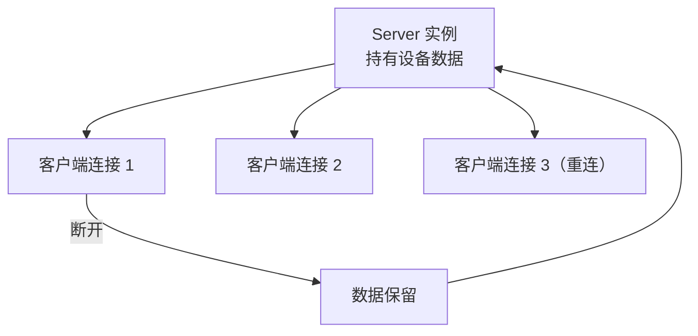

# 托管应用层

前八层给了完整的协议能力，但直接用它们写一个能跑的服务端，需要处理这些事：

- 创建 `IoRuntime` 并在某个线程驱动它
- 建立通道并接线
- 构造 `Session`，设置各类回调
- 处理 CONNECT 登录等待
- 保证析构时线程和回调的生命周期正确

这些事**每次都要重做一遍，且很容易做错**。`app` 层把它们封装起来，让协议对接的最小代码降到几行。

```cpp
/** @brief 自动管理传输、登录等待及应用关联的同步客户机。 */
/** @brief 自动管理运行线程、协议连接和设备数据的 TCP/串口服务器。 */
```

## 三行起一个服务端

```cpp
#include <dlt698/app.hpp>

dlt698::app::Server server;
auto value = server.set({0x200F, 2, 0}, dlt698::model::UInt16{5000});
auto started = server.start_tcp("0.0.0.0", 6980);
```

三行代码完成：创建服务器、发布一个属性、启动 TCP 监听。

```cpp
if (value && started) {
    // 检查成功后，应用可以继续自己的业务
}
// 运行中仍可调用 server.set(...)
```

**必须检查返回值。** `Result` 是 `[[nodiscard]]`，忽略它会有编译警告——这是刻意设计的。`set` 可能因为资源预算耗尽失败，`start_tcp` 可能因为端口被占用失败。

服务器**自动管理运行线程**，不需要用户手动开线程驱动 `IoRuntime`。这是 `app` 层相对底层最大的便利。

需要停止时：

```cpp
server.stop();   // 析构也会收尾
```

## 三行连一个客户机

```cpp
dlt698::app::Client client;
auto connected = client.connect_tcp("127.0.0.1", 6980);
// 检查 connected 成功后再读取
auto value = client.get({0x200F, 2, 0});
```

`Client` 是**同步**的——`connect_tcp` 会阻塞直到 CONNECT 登录完成，`get` 会阻塞直到响应回来。

「同步等待，隐藏执行器」意味着内部用 `SyncClientService` 在异步会话上做阻塞等待。这个封装的价值在于：应用代码是顺序的、易读的，而底层的异步能力一点没丢。

## 数据跨连接保留

```cpp
// 设备数据跨连接和同实例重启保留
```

这是 `Server` 的一个重要语义：**数据属于服务器实例，不属于连接**。



客户端断开重连，看到的还是同一份数据。同一个 `Server` 实例重启（比如 `stop()` 后再 `start_tcp()`），数据也在。

这背后的实现是 [对象服务层的 `Device`](./service.mdx)——它与连接生命周期独立，`Server` 只是挂了一个 `Device` 上去。

如果数据属于连接，那么每次重连都要重新发布所有点位，这对实际应用是灾难。

## Connection：关联场景

```cpp
/** @brief 托管客户端和服务器共用的协议关联场景。 */
```

`Connection` 是 `Server` 和 `Client` 共用的关联场景封装。它代表「一个已经建立的协议关联」——登录已完成，可以收发业务。

为什么把它抽出来？因为两端都需要这个概念：

- `Server` 侧：每个接入的客户端对应一个 `Connection`
- `Client` 侧：自己对应一个 `Connection`

抽出来之后，共用的逻辑——超时、诊断回调、traffic 观察器——就不必写两遍。

## 同步接口与异步接口

`app` 层同时提供两种风格：

| 风格 | 接口 | 适用场景 |
| --- | --- | --- |
| 同步 | `client.get(oad)` | 脚本、测试、简单工具 |
| 异步 | `session.async_get(oad, handler)` | 需要并发或长时间运行的业务 |

同步接口内部走的是异步实现 + 阻塞等待。**这不是两套实现，是一套实现的两种等待方式**，所以行为完全一致。

选同步还是异步，看应用是否需要在等待期间做别的事。如果需要，选异步；如果一段代码就是「发出去、等结果、拿结果处理」，同步写起来清楚得多。

## 串口同样简单

```cpp
server.start_serial("COM3", 9600);
client.open_serial("COM4", 9600);
```

和 TCP 一模一样。串口的时序细节由 `SerialLinkChannel` 处理（见 [传输层](./transport.mdx)），应用不需要感知 FE 前导和 33 位间隔。

## 示例程序

`app/` 目录下的示例是配对的，可以直接运行验证：

| 程序 | 角色 |
| --- | --- |
| `dlt698_server` | 发布 8 组模拟电表属性后启动 TCP 或串口，按 Enter 停止 |
| `dlt698_client` | 批量读取模拟属性及单相、费率元素，显示实际值和单位后断开 |

`dlt698_client` 会读取频率、三相电压电流、有功无功功率、功率因数、分费率电能和通信地址，并演示单独读取 A 相电压及费率 1 电能。

注意「显示实际值和单位」——这正是 `standard` 层工程值换算的效果，示例程序直接拿到了可读的物理量，而不是原始的倍率编码整数。

## 地址配置

`app/` 和 `transport/` 的示例在源码中显式配置电表地址：

```cpp
// 默认 000000000000（六个 0x00 字节）
// 逻辑地址和客户端地址 CA 均为 0
```

**修改时两端配置须一致**。地址按线序填写，低有效字节在前：

```text
123456789012  →  {0x12, 0x90, 0x78, 0x56, 0x34, 0x12}
```

这个地址顺序在 [链路层](./link.mdx) 已经强调过一次——它是 698 里最容易搞错、且错了最难发现的地方之一。托管服务端的通信地址属性 `4001/2/0` 复用同一份配置。

## app 层省掉了什么

把三行代码背后隐藏的工作列出来，能看出这个层的价值：

| 自动完成 | 手动做需要 |
| --- | --- |
| 创建并驱动 `IoRuntime` 线程 | 开线程、循环 `run()`、正确退出 |
| 建立通道并接线 `Session` | 构造通道、Session，设置回调 |
| CONNECT 登录并等待成功 | 处理登录响应、超时、重试 |
| 管理 Connection 生命周期 | 每连接创建和销毁关联 |
| 数据跨连接保留 | 自己实现数据持久层 |
| 析构时正确收尾 | 处理线程退出、回调投递 |

**这些事做对一次不难，难的是每次都做对。** 把它们固化在库里的价值，比省下的那几行代码更大。

上游是 [传输层](./transport.mdx)，它把会话、对象服务和传输编排成一个可直接使用的应用。