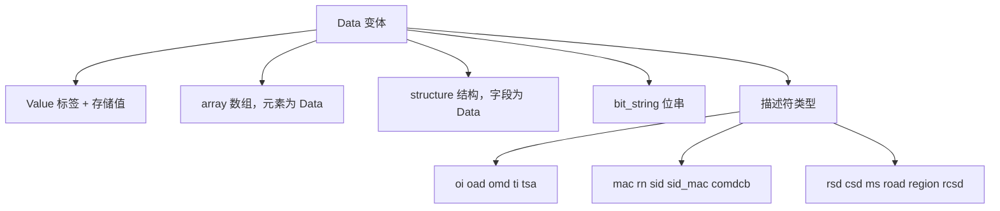
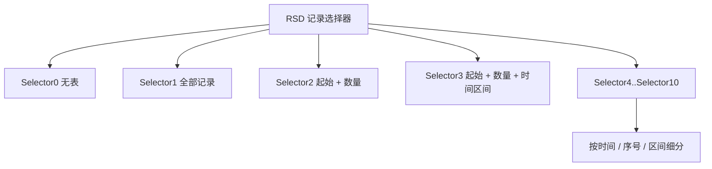

# 编解码层

编解码层解决一个朴素的问题：**协议里的字节，怎么变成 C++ 里的对象。**

它由两个命名空间组成：

- `model` — 数据模型定义「有哪些类型」，不碰字节
- `codec` — 在模型和字节之间双向转换

分开的理由是记录选择器。`RSD` 内部嵌 `Data`，而 `Data` 里又有各种描述符类型，如果编解码和模型写在一起会形成递归定义。模型层用一个不可变的 `RecordSelector` 节点专门打破这个循环。

## 错误模型先于一切

在讲具体类型之前，得先说 `common::Result`。因为它决定了编解码层所有接口的形状。

```cpp
template <class T>
class [[nodiscard]] Result {
    explicit operator bool() const noexcept;
    T& value() &;                                    // 抛 bad_variant_access
    const T& value() const&;
    T&& value() &&;
    const Error& error() const;
};
```

`[[nodiscard]]` 是刻意的。丢掉一个 `Result` 就等于丢掉一次错误检查，编译器应该为此报警。

`Error` 的四个字段：

| 字段 | 含义 |
| --- | --- |
| `code` | 19 类错误码之一 |
| `offset` | 出错的字节位置 |
| `context` | 字段名，或传输层错误描述 |
| `remote_code` | 远端 ERROR-Response 的原始编码 |

`offset` 是联调时的救命字段。收到「解码失败，偏移 37」能直接去抓包数第 37 个字节；收到「解码失败」就只能从头猜。

### need_more_data 是特殊的

19 个错误码里，`need_more_data` 值得单独说：

```cpp
need_more_data,  // 数据不够，等更多字节
invalid_length,   // 长度非法
invalid_value,    // 值非法
// ...
```

增量流解析的根本前提就是「数据不够」必须和「数据是错的」区分开。前者要继续等待，后者要报错。**把两者混成一个错误码，流解析就没法实现**——这是我在实现过程中踩得最实在的一个坑。

## ByteView：借而不持

```cpp
class ByteView {
    ByteView(const std::uint8_t* data, std::size_t size);
    ByteView(const Bytes& data) noexcept;
    ByteView(Bytes&&) = delete;         // 禁止借用临时容器
    ByteView(const Bytes&&) = delete;

    ByteView subview(std::size_t offset, std::size_t size) const;
};
```

解析器不应该为了读一个字段就拷贝一次字节。`ByteView` 只借用连续内存，配合 `subview` 可以在已有视图上切子段，零拷贝地逐字段推进。

代价是生命周期风险：底层内存一旦失效，视图就悬空。头文件用两个删除的重载把最常见的坑堵死——**不允许借用右值**。

写出时对应 `Cursor`，带边界检查的写入游标。资源限制（单帧字节上限、嵌套深度上限）在这一层统一实施，超限返回 `resource_limit`，不会让恶意或损坏的报文把栈打爆。

## A-XDR 长度编码

规约用的是 A-XDR 变长整数：短形式 1 字节，长形式首字节最高位为 1、低 7 位指示后续长度字节数。

```cpp
DLT698_API Result<std::size_t> read_length(ByteView input, std::size_t& offset);
DLT698_API Result<void> write_length(Bytes& output, std::size_t length);
```

`read_length` 的返回结构能看出意图：`length` 通过输出参数给，`offset` 双向传递（进是当前位置，出是消费到的位置）。解析完一个字段后，后续字节仍留给组合解析——这是 `read_data` 和 `decode_data` 的区别。

写的时候**总是用最短编码形式**。规约允许长形式，但最短形式节省流量，长度字段本身的代价更小。

## 40 类 Data 标签

`DataType` 枚举严格对应规约的标签值：

```cpp
enum class DataType : std::uint8_t {
    null = 0, array = 1, structure = 2, boolean = 3, bit_string = 4,
    int32 = 5, uint32 = 6, octet_string = 9, visible_string = 10,
    utf8_string = 12, int8 = 15, int16 = 16, uint8 = 17, uint16 = 18,
    int64 = 20, uint64 = 21, enumeration = 22, float32 = 23, float64 = 24,
    date_time = 25, date = 26, time = 27, date_time_s = 28,
    oi = 80, oad = 81, road = 82, omd = 83, ti = 84, tsa = 85,
    mac = 86, rn = 87, region = 88, scaler_unit = 89, rsd = 90,
    csd = 91, ms = 92, sid = 93, sid_mac = 94, comdcb = 95, rcsd = 96,
};
```

注意标签不是连续的——规约在 7、8、11、13、14、19 等位置留了空位。**枚举值必须等于线上标签值，不能用序号重新编号**，否则编码出来全是错的。

### Value 把标签编译进去

这是 `model` 层最关键的决定：

```cpp
template <DataType Tag, class T>
struct Value {
    static constexpr DataType type = Tag;
    // 存储值与协议标签绑定
};
```

协议里 `uint16`（标签 18，2 字节）和 `uint32`（标签 6，4 字节）如果都用 `uint32_t` 存储，编译器不会报错，但把 UInt32 的值塞进 UInt16 的字段，运行时排查极其痛苦。

绑进类型之后，`Value<DataType::uint16, std::uint16_t>` 和 `Value<DataType::uint32, std::uint32_t>` 是两个不可混淆的类型。**把运行期错误提前到编译期**，代价只是模板。

`Data` 是这个标签的宿主：



数组和结构是递归的（元素和字段都是 `Data`），描述符类型则各自是独立结构体。`BitString` 的比较包含**填充位**——因为填充位不同意味着编码信息不同，不能当成相等。

## 记录选择器

读记录（冻结数据、事件）是 698 里最复杂的服务，因为规约允许「选哪些列、选哪些行」的组合表达。

`RecordSelector` 把标准的 CHOICE 全部分支都保留下来：



行选择器同样保留十个分支：

```cpp
struct NoMeters {};        // 不指定
struct AllMeters {};       // 全部
struct MeterTypes {};      // 按表类型
struct MeterAddresses {};  // 按表地址
struct MeterNumbers {};    // 按表序号
struct MeterTypeRegions {};      // 表类型 + 区域
struct MeterAddressRegions {};   // 表地址 + 区域
struct MeterNumberRegions {};    // 表序号 + 区域
```

列选择器 `CSD` 保存完整的 OAD 及其顺序，而 `MS`（方式选择）有八个分支。

### 为什么必须保留所有分支

 如果图省事简化成「起止行号 + 列数组」，代码会短很多，但会丢掉标准表达力。有些查询用简化模型根本表达不出来，代码虽然短了，遇到规约里没覆盖到的查询就抓瞎。

**代价是代码量，收益是不丢能力**。协议库在这里不该偷懒。

## 这一层的边界

编解码层不知道对象是什么，不知道会话怎么管，甚至不知道字节从 TCP 来还是从串口来。它只做一件事：**在 `ByteView` 和 C++ 对象之间转换**。

这个纯度带来一个实际好处——它可以在 `MemoryChannel` 上被完整测试，不需要任何 I/O。想验证一段记录选择器的解码逻辑，喂一串字节就行，不用起服务，不用连设备。