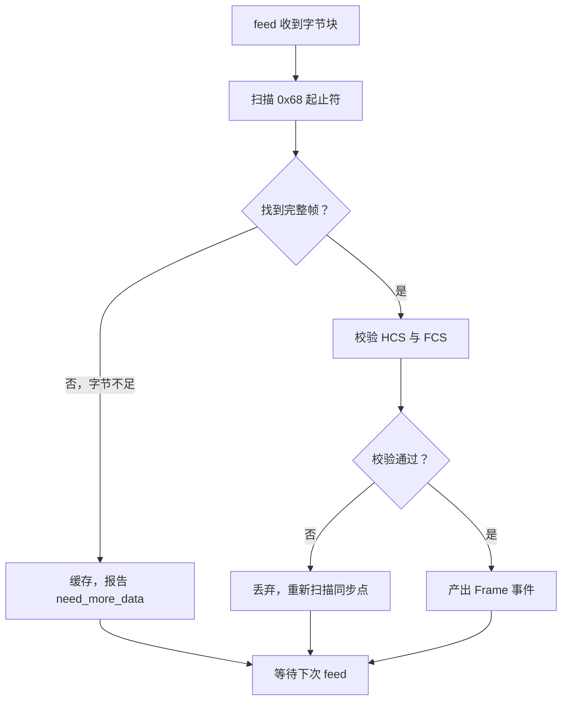

# 链路层

链路层是协议栈里最「脏」的一层。它面对的是真实的字节流——可能半帧、可能粘帧、可能中间混进噪声、可能有校验错误的垃圾数据。

dlt698 把这一层拆成三个文件，各管一件事：

| 文件 | 职责 |
| --- | --- |
| `frame.hpp` | 链路帧模型、HCS / FCS 校验、增量流解析 |
| `fragment.hpp` | 分片格式域、分片发送与有界重组 |

**它不认识 APDU，不认识对象，不认识会话。** 输入是字节，输出是「一个完整帧」或「还需要更多字节」。

## 链路帧

```cpp
struct ServerAddress {
    AddressType type = AddressType::single;   // 单播 / 通配 / 组播 / 广播
    std::uint8_t logical = 0;                 // 0 至 3
    Bytes bytes = {0};                        // 按线序保存，低有效字节在前
};

struct Frame {
    std::uint8_t control = 0x43;
    ServerAddress server;
    std::uint8_t client = 0;
    Bytes payload;                            // 未扰码的用户数据
};
```

两个容易踩的细节：

**地址按线序保存，低有效字节在前。** 规约里的地址 `123456789012` 对应 `{0x12, 0x90, 0x78, 0x56, 0x34, 0x12}`，不是直觉上的 `12 34 56 78 90 12`。写成大端顺序会得到一个语法正确但完全错误的地址，而且极难发现。

**payload 是未扰码的。** 逻辑帧里保存的是原始用户数据，扰码 SC 是编码时才施加的。这样比较两个帧是否相同时，不需要先解码扰码。

## CRC 校验

```cpp
DLT698_API std::uint16_t crc16(ByteView bytes) noexcept;
```

初值和最终异或值都是 `0xFFFF`，反射多项式 `0x8408`，线上低字节在前发送。

用反射多项式是因为规约指定了这个算法，不能用别的 CRC 代替——**这不是可以自由选择的实现细节**。

编码时 `encode_frame` 负责在控制域之后插入 HCS、在末尾追加 FCS：

```cpp
DLT698_API Result<Bytes> encode_frame(const Frame& frame, const Limits& limits = {});
DLT698_API Result<Frame> decode_frame(ByteView bytes, const Limits& limits = {});
```

`Limits` 是资源上限，同时受 14 位协议长度字段约束。超限返回 `resource_limit`，不会分配超大的缓冲区。

## 增量流解析

这是链路层最有价值的部分。真实的 TCP 字节流**不保证一帧对齐**：

- **半帧** — 一次 `feed` 只收到半帧，剩下的下次才到
- **粘帧** — 一次 `feed` 收到三帧半
- **噪声** — 帧之间混入垃圾字节
- **校验失败** — 噪声恰好被当成帧头

`FrameStreamDecoder` 处理全部四种情况：

```cpp
DLT698_API std::vector<StreamEvent> feed(ByteView bytes);
DLT698_API std::size_t buffered() const noexcept;   // 等待后续字节的缓存长度
```

`feed` 返回一组**事件**而不是单帧，因为一次输入可能产生零个、一个或多个事件。返回 `vector` 让调用方自然地循环处理。



关键在于**校验失败后的重新同步**：不丢弃整个输入块，而是跳过这一个假帧，从下一个字节继续找 `0x68`。这让一次噪声不会导致后面所有数据丢失。

同样重要的是**不能被复制**：

```cpp
FrameStreamDecoder(const FrameStreamDecoder&) = delete;
FrameStreamDecoder(FrameStreamDecoder&&) noexcept;   // 只允许移动
```

解析器内部有「已经消费到哪」的游标状态。复制它等于两个对象共享同一份解析进度，行为无法预期。删掉拷贝、保留移动是唯一正确的选择。

## 分片

当一个 APDU 超过单帧长度限制时，需要拆成多个链路帧传输。每片带一个两字节的分帧格式域：

```cpp
enum class FragmentType : std::uint8_t {
    first = 0, last = 1, acknowledgement = 2, middle = 3
};

struct Fragment {
    FragmentType type = FragmentType::first;
    std::uint16_t sequence = 0;   // 12 位，0 至 4095
    Bytes data;
};
```

确认帧（`acknowledgement`）不得包含数据——这是一个可以在编解码阶段就拒绝的非法组合。

### 发送侧

```cpp
DLT698_API LinkFragmenter(Bytes apdu, std::size_t fragment_bytes, std::size_t limit);
DLT698_API Fragment current() const;                        // 重复调用不前进
DLT698_API Result<void> acknowledge(std::uint16_t sequence);
```

`current()` 重复调用不前进，这让它天然支持**超时重发**——重发时拿到的还是同一片。序号用 12 位，会回绕，所以确认必须校验「最近正确序号」，过期确认直接拒绝。

### 接收侧

```cpp
DLT698_API Result<Reassembly> accept(const Fragment& fragment);
DLT698_API void reset();
```

`Reassembly` 的三个字段各管一件事：

| 字段 | 含义 |
| --- | --- |
| `acknowledge` | 需要回复确认的序号（非末片时） |
| `apdu` | 重组完成的完整 APDU |
| `duplicate` | 这是重复片段，不要重复提交 |

**重复片段不重复提交 APDU**。这是必须的：链路层有重发机制，对端没收到确认就会重发，如果不去重，同一个 APDU 会被上层处理两次。

还有一条标准细节：**末片直接交付应用，不等待链路确认**。这个行为写在头文件注释里，因为它是规约图 16/17 规定的，实现时容易按直觉写成「所有片都要确认」。

### 有界是硬要求

```cpp
DLT698_API explicit LinkReassembler(std::size_t limit);
```

`limit` 是完整 APDU 的字节上限，必须大于零。重组缓冲区**始终有界**——如果对端只发 first 片然后消失，这个缓冲区不能无限增长。

接收器只保证「单对端、单条重组通道」，不创建定时器。超时、地址检查、方向检查交给上层，因为那些决策需要应用上下文。

## 扰码 SC

控制字的 SC 位启用时，用户数据每个字节加 `0x33`。规约用它避免长报文里出现类似帧头的字节序列。

`encode_frame` 在 SC 位启用时自动施加，`decode_frame` 自动去除。**使用者不需要关心**，payload 在逻辑帧里始终是未扰码的。

分帧头和片段同样适用，所以解码顺序是：定位帧 → 校验 HCS / FCS → 去 SC → 处理分片格式域。顺序不能错，否则拿到的是加过 0x33 的数据。

## 这一层容易犯的错

| 错误 | 后果 |
| --- | --- |
| 地址按大端顺序填 | 地址错误，表现为连不上正确设备 |
| 复制了 `FrameStreamDecoder` | 解析进度错乱，行为不可预期 |
| 混淆 `need_more_data` 和解析失败 | 流解析无法实现 |
| 重组无缓冲区上限 | 恶意或损坏对端可耗尽内存 |
| 末片也回复确认 | 与规约图 16/17 不符，对端可能重发 |

这些都不是理论问题。地址顺序和流解析游标两条在实现初期都真实出现过。

## 边界

链路层的输出是 `Frame`，`Frame::payload` 里可能装着完整的 APDU，也可能装着分片头。它**不做重组之外的事**，更不知道 payload 里是什么服务。

这个隔离让整层可以在 `MemoryChannel` 上完整测试——甚至不需要通道，直接构造字节调用 `feed` 就行。

上游是 [应用层 APDU](./apdu.mdx)，下游是 [编解码层](./codec.mdx)。