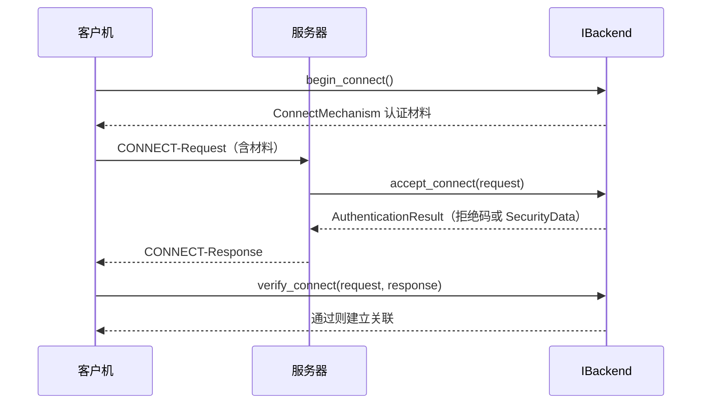

# 安全层

电力规约的安全模块是个特殊问题：算法在芯片里，密钥在硬件里，SDK 是厂商私有的。任何开源库都无法真正实现它。

dlt698 的选择很明确：**定义合约，不实现算法。**

```cpp
/** @brief ESAM 厂商 SDK 的协议安全适配合约；库不保存明文密钥。 */
```

## 为什么不做密码学实现

三个现实原因：

1. **密钥在硬件里。** ESAM 模块管理密钥，库拿不到明文，也不需要拿到。
2. **算法由厂商 SDK 提供。** 各家 SDK 接口不同，库去适配等于替每家 SDK 背书。
3. **自己实现密码学是危险的。** 自研加密实现的失误概率远高于写业务代码，而错误的代价是安全失效。

所以库提供的是一个**清晰的接口**，让接入方把自己的 SDK 适配进来。

## 明确的安全边界

```cpp
/** @brief 每个 Session 独占的有状态安全后端，实际密码操作交给 ESAM/厂商 SDK。 */
class DLT698_API IBackend;
```

一句话点出关键约束：**每个 Session 独占**。

```cpp
/** @note 同一实例不得在多个 Session 中复用。 */
```

为什么？因为后端**有状态**——保存随机数、会话密钥引用和重放状态。多个 Session 共用一个实例，随机数就可能撞车，重放防护就失效了。

这是典型的「看似能用，实则不安全」的陷阱：一个可复用的接口看起来更方便，用的人不会想到状态会互相污染。**在接口层面禁止掉，比在文档里提醒可靠。**

## 默认拒绝

```cpp
struct AuthenticationResult {
    std::uint8_t result = 255;  ///< CONNECT 标准结果码，默认拒绝。
    std::optional<protocol::apdu::SecurityData> security;
};
```

`result` 默认是 `255`——规约里的**拒绝码**。

和 [对象服务层 `IObjectProvider` 的默认拒绝](./service.mdx) 是同一个思路：**默认状态必须是不安全的**，要变安全必须显式实现。

如果 `result` 默认是「通过」，一个不完整的实现就会让所有连接被放行，而且不会有任何报错。

## 认证流程三步



| 方法 | 责任 |
| --- | --- |
| `begin_connect()` | 客户机准备认证材料 |
| `accept_connect()` | 服务器校验请求并生成响应 |
| `verify_connect()` | 客户机验证响应，成功才建立关联 |

### 验证失败必须关闭会话

```cpp
/** @note 认证通过或错误；失败时 Session 关闭，不能建立关联。 */
```

`verify_connect` 失败**不是「降级为公共认证」**，而是直接关闭。

同样的原则写在 `accept_connect` 上：

```cpp
/** @note 是否允许公共连接由后端安全策略决定，不能隐式退回公共认证。 */
```

「不能隐式退回公共认证」——这条约束是整个安全层的核心。

如果认证失败后自动退回未加密模式，那攻击者只要让认证失败就能让连接降级到明文，整个安全机制形同虚设。**降级必须是显式的、策略允许的操作，绝不能是错误处理路径的默认行为。**

## SECURITY 外层封装

认证通过后，业务报文走 SECURITY 封装：

| 方向 | 发送 | 接收 |
| --- | --- | --- |
| 客户机 | `protect_request()` | `open_response()` |
| 服务器 | `protect_response()` | `open_request()` |

```cpp
/** @brief SECURITY 外层安全传输封装；不执行任何密码学操作。 */
```

外层封装只负责**结构**：把内层 APDU 放进安全外壳，加上必要的外层字段并加扰码。真正的加密、签名、MAC 全在后端。

### 借用视图不得保存

```cpp
/** @param[in] application 完整内层 APDU，不得保存借用视图。 */
```

`protect_request` 和 `protect_response` 接收的 `application` 是 `ByteView`——**借用**视图，只能在调用期间有效。

如果后端实现把这个视图存起来稍后使用，就会悬垂。这类约定必须写在接口注释里，因为后端实现通常写在另一个文件甚至另一个团队手里。

### 验证失败不得交付

```cpp
/** @return 完整、经认证的内层 APDU 或安全错误；失败不得向业务 provider 交付。 */
/** @return 完整、经认证的内层 APDU 或错误；验证结果 DAR 不能被视为明文。 */
```

第二句尤其重要：**「验证结果 DAR 不能被视为明文」**。

这是一个非常容易犯的错误。安全响应验证失败时，对端可能返回一个 DAR（比如「认证失败」「会话密钥过期」）。如果实现把这个 DAR 解码后当成业务数据交给上层，应用就会拿一个错误码当业务数据处理——而且是**已经过认证流程处理的**，看起来更可信。

「DAR 不是明文」这句话，是写给所有会碰这块代码的人的警告，包括未来的维护者。

## 生命周期

```cpp
/** @brief 清除随机数、会话密钥引用和重放状态；关闭/释放/析构时调用，幂等且不抛异常。 */
virtual void reset() noexcept = 0;
```

`reset` 的三个约束各管一件事：

| 约束 | 原因 |
| --- | --- |
| 幂等 | 关闭、释放、析构三个路径都会调用，可能重复 |
| `noexcept` | 析构路径上抛异常会直接终止程序 |
| 清理重放状态 | 否则下次连接可能接受旧的报文 |

## 执行器约束

```cpp
/** @note 所有方法在 Session 串行执行器内调用，必须有界且不得阻塞等待该执行器。 */
```

安全方法在会话的串行执行器上执行——这意味着**它们必须是快速返回的**。

如果厂商 SDK 的操作很慢（比如读 ESAM 硬件需要几毫秒），实现应该：

```cpp
// 正确：外部线程预处理
Result<SecurityData> accept_connect(const ConnectRequest& request) override {
    // 硬件操作已在外部线程完成，这里只取结果
    return CachedResult();
}
```

头文件里也点明了出路：「**硬件驱动可在外部线程预处理并提供有界结果**」。

在执行器里阻塞等待硬件，会导致整个会话的心跳、超时全部停摆。现场表现是「设备偶尔响应超时」，但根因在安全层的同步阻塞——这类问题排查起来非常费时间。

## SECURITY 服务编解码

```cpp
/** @brief SECURITY 外层安全传输封装；不执行任何密码学操作。 */
```

对应 [应用层 APDU](./apdu.mdx) 里的 SECURITY 服务：

| 能力 | 状态 |
| --- | --- |
| 外层 codec | ✅ |
| 后端状态机 | ✅ |
| 实机 ESAM 验收 | ⚠️ 待接入 |

编解码是完整的，状态机是完整的，**只差真实的 ESAM SDK 和测试凭据**。这是当前明确标注为「待完成」的部分，需要厂商模块型号和实际测试环境才能验收。

## 默认路径

不配置安全后端时，CONNECT 走**公共认证**——这是规约允许的模式，适合内网或联调环境。

安全是可选增强，不是强制前提。这样库才能在没有 ESAM 硬件的环境里开发和测试；但**一旦配置了后端，所有路径都必须走安全验证**，不存在「有时候认证有时候不认证」的中间状态。