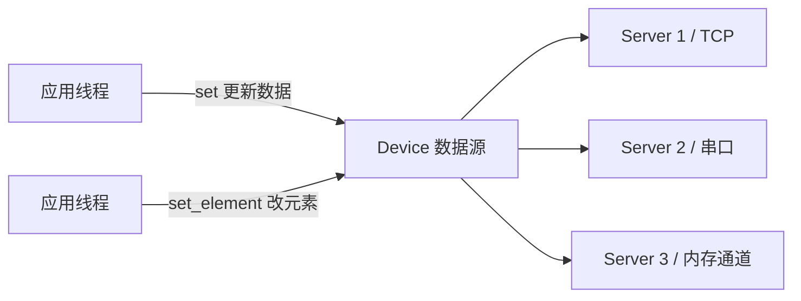

# 对象服务层

对象服务层是**唯一真正持有数据**的一层。它回答的问题是：收到一个 GET 请求，数据从哪来？收到一个 SET 请求，改哪个字段？

```cpp
/** @brief 通用对象 schema、读写/方法 provider 和内存模拟对象。 */
/** @brief 与连接生命周期独立的线程安全设备数据入口。 */
```

## IObjectProvider：默认拒绝

这是这一层最重要的接口：

```cpp
class DLT698_API IObjectProvider {
    virtual ObjectValue read(const model::Oad& attribute) = 0;
    virtual protocol::apdu::RecordResult read_record(const protocol::apdu::GetRecord& query);
    virtual std::uint8_t write(const model::Oad& attribute, const model::Data& value);
    virtual ActionValue invoke(const model::Omd& method, const model::Data& parameter);
};
```

注意只有 `read` 是纯虚函数，其余三个都有**默认实现，且默认全部拒绝**：

| 方法 | 默认行为 | DAR |
| --- | --- | --- |
| `read_record` | 拒绝 | DAR=3 |
| `write` | 拒绝 | 保持只读合约 |
| `invoke` | 拒绝 | 拒绝方法调用 |

**这是一个刻意的安全设计，不是省事。**

如果 `write` 是纯虚函数，每个只读 provider 都得写一个「拒绝」的实现。写的人多了，总有人会写成「先返回成功，实际没做」——于是客户端以为设置成功了，读回来却是旧值。

默认拒绝把这个错误变成了编译期之后的**默认正确**：只读 provider 不需要任何额外代码就天然是只读的，要支持写入必须显式覆盖。

这个思路和「密码类接口默认拒绝」是同一类：**让错误配置在默认状态下无害**。

### 约定写在注释里

```cpp
/** @brief 读取一个属性，快照特征及元素索引由 provider 解释。 */
/** @brief 执行方法，默认拒绝；调用发生在会话执行器中。 */
```

第二条尤其重要——**方法调用发生在会话执行器中**。这意味着 provider 的 `invoke` 实现不需要自己加锁，但**绝对不能阻塞**，否则会卡住整个会话的串行执行器，导致心跳、超时全都停摆。

这类约定不写清楚，使用者很容易在 provider 里写一句同步的数据库查询，然后现场表现为「偶发心跳超时」。

## ObjectRegistry

```cpp
class ObjectRegistry {
    ObjectRegistry(const ObjectRegistry&) = delete;
    // 注册对象及 provider
    // 按 schema 权限及类型检查读取属性
    // 检查记录声明与读权限后查询，目录锁外调用 provider
};
```

三条设计约束：

**不可复制。** 目录持有 schema 和 provider 的所有权，复制它会产生两份所有权。

**读操作先检查 schema 权限和类型，再调用 provider。** 顺序很重要——先校验再调用，避免用非法 OAD 去打扰 provider。

**「目录锁外调用 provider」。** 这条最关键：`ObjectRegistry` 内部有锁保护目录结构，但如果持锁调用 `provider->read(...)`，而 provider 的实现里又回调了注册表，就会死锁。

因此实现上必须**先在锁内取到需要的 provider 引用并放锁，再在锁外调用**。这类「锁内取、锁外用」的规则，是所有带锁的注册表都会遇到的通用问题。

## Device：与连接生命周期独立

```cpp
/** @brief 与连接生命周期独立的线程安全设备数据入口。 */
/** @brief 本地数据设备，默认只读地对外发布标准属性，可被多个服务器共享。 */
class Device {
    DLT698_API explicit Device(DeviceOptions options = {});
    DLT698_API Result<void> set(model::Oad attribute, model::Data value);
    DLT698_API Result<void> set_element(model::Oad attribute, model::Data value);
    DLT698_API ObjectValue get(model::Oad attribute) const;
    DLT698_API Result<void> define(ObjectSchema schema);
};
```

「与连接生命周期独立」是这个类的核心价值。

客户端断开、设备重启、服务器重启——这些都不应该影响数据本身。`Device` 独立存在，可以被**多个 `Server` 实例共享**：



三个服务器看到的是同一份实时数据。应用线程随时可以 `set` 更新，多个客户端立即读到新值。

### 快照语义

```cpp
/** @brief 本地读取完整属性或一级元素的拥有内存的快照。 */
```

`get` 返回的是**拥有内存的快照**，不是引用。

原因很实际：如果返回引用，一个客户端正在读数组，另一个线程同时 `set_element`，读到一半的数据就自相矛盾了。快照让「这次读取」看到一个自洽的版本。

析构函数的注释也印证这一点：「释放设备持有的数据，**正在读取的快照仍由读取方持有**」。因为快照是拥有内存的，设备销毁后正在读的人不受影响——这让 Device 的生命周期管理变得简单。

### set_element 的粒度

```cpp
Result<void> set_element(model::Oad attribute, model::Data value);
```

只更新「一级元素」，不递归深入。规约里的数组和结构可以嵌套很深，允许任意深度更新会让并发控制复杂度爆炸。限定在一级，既覆盖了「更新第 3 个费率电能」这类真实需求，又把锁的粒度控制住。

### define：自定义对象

```cpp
/** @brief 声明厂家自定义只读数据对象，不发布未设置的属性。 */
Result<void> define(ObjectSchema schema);
```

「**不发布未设置的属性**」——声明了 schema 不等于有数据。只有 `set` 过之后，对外才能读到。

这个约定避免了「声明了但读到空值」的中间状态。客户端拿到空值和拿到 DAR 是两回事：前者会当成有效数据处理，后者才知道该重试。

## 同步等待适配

```cpp
/** @brief 在统一异步会话上提供同步等待适配，不创建隐藏线程。 */
```

整个库的异步接口都是回调式的，但实际使用中同步代码更常见。`sync.hpp` 提供同步等待包装。

**「不创建隐藏线程」是核心约束。** 同步等待的实现方式是阻塞当前线程等待回调，而不是开一个后台线程去等。

```cpp
// 伪代码
auto result = SyncClientService{session}.get(oad);   // 阻塞当前线程
```

如果它在内部开线程，就会有一个使用者在感知不到的后台线程，线程数、生命周期、异常传播全成问题。阻塞当前线程虽然简单粗暴（要用 `condition_variable`），但语义清晰：**这段代码本来就在等结果**。

## memory_records：只读记录后端

```cpp
/** @brief 有界、只读的标准记录模拟后端，保存配置列的记录投影。 */
```

这是给测试和演示用的记录后端。它**有界且只读**——保存配置列的记录投影，不接受写入。

记录查询（冻结数据、事件记录）涉及复杂的行列筛选逻辑。真实实现需要接数据库，但那样就无法在测试里构造确定性的数据。这个内存后端让记录相关逻辑可以在 `MemoryChannel` 上完整测试。

**它只用于测试和示例，不用于生产。** 真实设备的记录需要从实际存储中读取。

## point_probe：显式探测

```cpp
/** @brief 显式发起候选普通点位验证，保留逐项 Data、DAR、事务及结构错误。 */
```

这个类的存在解决一个实际问题：**你怎么知道某个 OI 在对端设备上存不存在？**

规约有 122 个常用 OI，但具体型号的设备不一定都支持。`point_probe` 显式发起探测，**保留逐项的 Data、DAR、事务错误和结构错误**。

注意它保留三类不同的错误：

| 错误类型 | 含义 |
| --- | --- |
| DAR | 协议层拒绝，例如属性不存在、无权限 |
| 事务错误 | 请求本身失败，超时或连接问题 |
| 结构错误 | 响应格式不符合预期 |

把它们混在一起会导致「探测失败」这个结论无法区分「设备没这个点」和「网络出问题了」。**分开保留，调用方才能给出准确的判断。**

## 边界

对象服务层往下调用 [应用层 APDU](./apdu.mdx) 完成编解码，往上被 [会话层](./session.mdx) 和 [托管应用层](./app.mdx) 使用。

它不知道字节怎么传，也不知道连接什么时候建立。这让它可以在 `MemoryChannel` 上被完整测试——服务逻辑和传输彻底解耦。

标准点位和记录模板的定义在 [标准对象层](./standard.mdx)。