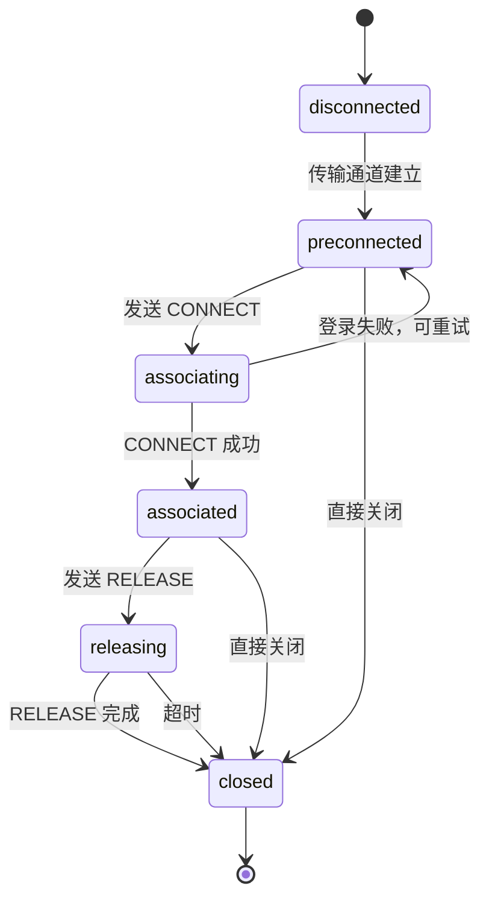
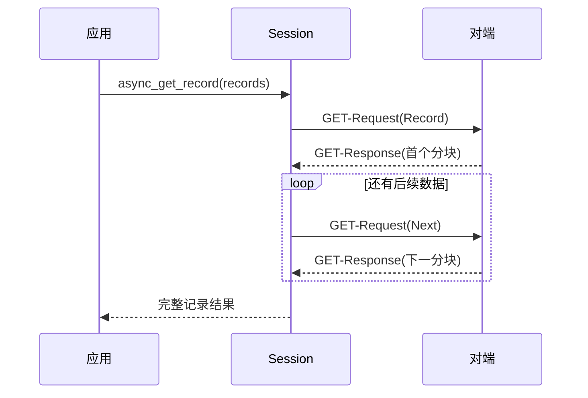

# 会话层

会话层回答的问题是：**一次请求和它的响应怎么配对？**

它管的是状态、事务、超时，不管数据从哪来（那是 [对象服务层](./service.mdx)），也不管字节怎么传（那是 [传输层](./transport.mdx)）。

```cpp
/** @brief 单个协议对端的连接、事务、持续接收和单调超时管理。 */
class Session;
```

一个 `Session` 对应一个通道上的一个协议对端。它不是连接池，也不管理多个对端。

## 六态状态机

```cpp
enum class State {
    disconnected,   // 未连接
    preconnected,  // 通道已建立，尚未登录
    associating,    // 正在登录
    associated,     // 已登录，可收发业务
    releasing,      // 正在释放
    closed,         // 已关闭
};
```



### 为什么要区分 preconnected 和 associated

因为 698 的 CONNECT 是**协议级登录**，不是传输级连接。

TCP 连上不代表能发业务请求——服务端可能还没完成地址校验、认证协商。`preconnected` 状态存在的意义就是让「通道通了」和「可以发业务了」这两件事分开。

**这个区分的实际价值是错误更早暴露**：在 `preconnected` 状态发业务请求，会被立刻拒绝（返回 `not_associated`），而不是发出去等对端回一个 LINK 错误再走一轮重新登录。

### 在错误状态下拒绝，比发出去再失败便宜

这是会话层设计的核心思路之一。`async_get` 的第一步是状态检查，不是编码：

```cpp
DLT698_API void async_exchange(protocol::apdu::Apdu request, ExchangeHandler handler);
// 内部先检查 State 与事务表，再构造 APDU
```

状态不对就直接失败。这不是保守，而是因为每个失败路径都要走「编码 → 分片 → 写出 → 等响应 → 匹配 → 超时处理」一整套，代价远大于一次状态检查。

## 单在途事务

会话层**同一时刻只允许一个在途事务**。

```cpp
DLT698_API void async_get(/* ... */);
DLT698_API void async_set(/* ... */);
DLT698_API void async_exchange(protocol::apdu::Apdu request, ExchangeHandler handler);
```

这是规约和现场现实的共同结果。规约用 PIID（进程标识）区分并发请求，但实现单在途有三个好处：

1. **匹配逻辑简单** — 收到响应检查 PIID 和 OAD 是否都对得上，不会串
2. **响应到达顺序确定** — 不会出现先发的请求后到导致状态错乱
3. **资源上界明确** — 事务表最多一项，内存占用可预测

需要并发的应用应该在应用层排队，或者开多个 `Session` 实例。

### 匹配依据

| 服务 | 匹配字段 |
| --- | --- |
| GET Normal | OAD |
| SET Normal | OAD |
| ACTION | 完整 OMD（OI + 方法 + 模式） |
| 高级服务 | `advanced_matches` 校验分支与描述符顺序 |

**PIID 和 OAD 都要对上**。只看 PIID 不够——对端可能因内部原因重发同一个 PIID 的响应；只看 OAD 也不够——同一批次读多个属性时 OAD 不同但可能并发。

## GET Next 收齐

记录查询可能超出一帧。会话层自动驱动分块循环：



**应用只发一次请求，收到一次完整结果。** 分块数可能是几十个，但对应用不可见。

这一层做的是「重组协议语义」，而不是「重组字节」——字节级的重组在链路层。两者独立，一个 APDU 可能既被链路分片又被协议分块。

## 超时与取消

会话层管理两类超时：

| 超时 | 作用 |
| --- | --- |
| 事务超时 | 请求发出后多久没响应算失败 |
| 心跳间隔 | LINK 报文的发送周期 |

两者都基于**单调时钟**（`std::chrono::steady_clock`），不受系统时间调整影响。用 `system_clock` 的话，NTP 校时或手动改时间会让正在等待的请求突然「超时」或「永不超时」。

### 回调生命周期

会话的回调都是异步的，但**关闭时必须仍然驱动执行器**：

```cpp
/** @brief 关闭通道，未完成事务以 closed 结束；仍需驱动执行器交付回调。 */
DLT698_API ~Session();
```

这条约束写在析构函数的注释里，很反直觉但很关键。析构时事务要结束，回调要收到 `closed` 错误——但回调是投递到执行器上的，如果执行器已经停了，回调就永远不投递，在途请求的应用侧永远悬着。

所以正确的用法是：**析构前先停止驱动执行器，让挂起的回调投递完**。这个约定不写清楚，使用者很容易写出会泄漏或悬垂的代码。

## 诊断与观察

会话层提供三类不干扰协议的回调：

```cpp
DLT698_API void set_diagnostic_handler(DiagnosticHandler handler);   // 不会抢占当前事务
DLT698_API void set_traffic_handler(/* ... */);                       // 通道收发观察
```

**「不抢占当前事务」是显式的设计约束**。诊断回调用于排查问题，如果它能打断正在处理的事务，就可能在关键路径上引入延迟。Traffic 观察器则更进一步——**完全不改变协议处理与事务匹配**，只是旁路记录收发字节。

联调时的用法是挂一个 traffic 观察器，把原始字节和解析结果对照打印出来。这类工具如果会影响协议行为，用起来就不可信了。

## Traffic 事件

```cpp
/** @brief 会话通道边界的收发观察事件与回调类型。 */
```

Traffic 事件定义在**通道边界**，也就是「字节进入会话」和「字节离开会话」两个时刻，不是链路帧内部。

这个位置选择是有意的：观察者看到的应该是「对端发来的原始字节」，而不是「解析出的帧」。现场排查时需要的是前者——因为问题恰恰经常出在解析之前。

## 配置校验

```cpp
DLT698_API Result<void> validate_options(const SessionOptions& options);
```

注意它的注释：「校验会话配置，**不构造会话、不调用安全工厂或清理后端**」。

这是一条重要的安全约定。配置校验是纯函数，绝不能有副作用——否则调用它「试一下」就会创建安全后端、注册清理回调。这类隐藏副作用在库代码里特别难排查。

## 边界

会话层的下界是「一个 APDU 对象」，上界是「一次完整的请求-响应往返」。

它不知道对象是什么，所以同一套会话代码既能配 `ServerService` 服务真实设备，也能配内存对象跑测试。

上游是 [对象服务层](./service.mdx)，下游是 [应用层 APDU](./apdu.mdx)。