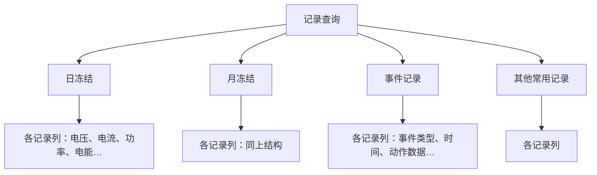

# 标准对象层

规约里定义了大量标准对象。如果这些对象只是文档里的表格，库就只是「会发报文的空壳」——用户每次读电压都得自己查 OI、猜 Data 类型。

`standard` 层解决的是：**把规约里的标准定义变成可用的代码。**

## 132 个 OI 常量

```cpp
inline constexpr std::uint16_t voltage = 0x2000;
inline constexpr std::uint16_t current = 0x2001;
inline constexpr std::uint16_t active_power = 0x2004;
inline constexpr std::uint16_t reactive_power = 0x2005;
inline constexpr std::uint16_t power_factor = 0x200a;
inline constexpr std::uint16_t frequency = 0x200f;
inline constexpr std::uint16_t date_time = 0x4000;
inline constexpr std::uint16_t communication_address = 0x4001;
```

对比一下不用这层的写法：

```cpp
// 不用 standard 层
auto value = client.get({0x200F, 2, 0});    // 这是什么？只能查文档

// 用 standard 层
auto value = client.get({oi::frequency, 2, 0});   // 一眼看懂
```

这不是糖，是**可维护性的差距**。`0x200F` 写错了编译器不会报错，`oi::frequency` 写错了立刻编译失败。

132 个常量覆盖电能、电压电流、功率、需量、状态、谐波、参数等类别。

## catalog：常用对象目录

```cpp
/** @brief DL/T 698.45—2017 常用标准对象、点位寻址和精确工程值。 */
```

`catalog` 在 OI 常量之上再做了一层：**对象和点位的寻址方式，以及工程值的精确换算**。

规约里同一个对象的不同属性有不同的寻址规则——有的用 OAD 直接寻址，有的要带索引，还有的要带属性标识。`catalog` 把这些规则封装起来：

```cpp
// 组合有功总电能
auto oad = catalog::address_of(oi::combination_active_energy, /* ... */);

// 分费率电能，索引是费率号
auto oad = catalog::rate_energy(oi::forward_active_energy_a, /* tariff = 1 */);
```

**精确工程值换算**是另一个容易被忽略的功能。规约里的原始值常常带倍率因子和单位编码：

```cpp
struct ScalerUnit {
    // 倍率指数 + 物理单位编码
};
```

规约里功率可能是 `int32` 加倍率指数，电能可能带单位。`catalog` 负责把原始值换算成带物理单位的工程值：

```cpp
auto value = catalog::to_engineering(oi::active_power, raw);
// 5000 → 50.00 Hz 或类似带单位的值
```

这层封装如果不做，用户每次读数据都要自己处理倍率和单位，是重复劳动，也是错误的来源。

## records：记录模板

```cpp
/** @brief 日/月冻结和常用事件的记录查询模板及行列校验。 */
```

记录查询是最容易写错的部分。规约定义了多个记录入口，每个入口有自己的列定义，列数和列类型都不同。

dlt698 覆盖了 **4 个记录入口 / 5 个记录列，共 131 个 OI**。



模板层做的是**行列校验**：构造一个记录选择器时，检查列的 OAD 是否属于该入口、列数是否符合规范、行列组合是否合法。

不做校验的后果是：把日冻结的列用到月冻结上，代码能编译，编码也能通过，但设备返回 DAR，现场排查半天发现是入口用错了。**校验前移到构造阶段，比在设备端失败好得多。**

## capabilities：能力协商解释

```cpp
/** @brief CONNECT 一致性位图解释、普通读取计划和候选点能力提示。 */
```

这是这一层最有特色的一块。规约里 CONNECT 响应带**能力位图**，表示对端支持哪些服务。

问题在于：位图是位，解释它需要知道 C.1 里每一位的确切含义。`capabilities` 封装了这层解释：

```cpp
/** @brief 有效 CONNECT 的协商参数；空值表示尚无能力信息，不等于对端不支持。 */
```

这句注释点出了一个容易搞错的地方：

> **「空值表示尚无能力信息，不等于对端不支持」**

还没协商成功，和协商了但不支持，是两件完全不同的事。混为一谈会导致「一连接就跳过所有高级服务」，即使设备其实都支持。

### 读取计划

```cpp
/** @brief 规划普通读取，List 不支持时拆成单项 Normal，未知能力采用 Normal。 */
```

这体现了整个库的**降级策略**哲学：

| 已知能力 | 未知能力 |
| --- | --- |
| List 支持 → 用 List，省报文 | 用 Normal，最保守的假设 |
| List 不支持 → 拆成多个 Normal | 同左 |

**未知时采用最小假设**。这是分布式系统里的通用原则：不知道对方支持什么，就用最小的、最普遍支持的方式，宁可多发几帧也不要猜错。

### 明确拒绝，不退化

```cpp
/** @brief 检查记录服务能力，已知不支持时明确拒绝，绝不退化为普通 GET。 */
```

这条规则和上面形成对比，非常重要：

- **普通读取**：List 不支持可以退化成 Normal，因为结果等价
- **记录查询**：能力不支持时**明确拒绝，绝不退化为普通 GET**

原因在于记录查询没有等价的普通读取形式。如果记录能力不支持，用普通 GET 去读，记录里有多个属性，`GetNormalList` 的语义完全对不上——**返回的数据是错的，但不是错的**。

这是最危险的一类 bug：能跑通、有返回、结果是错的。所以这里宁可失败也不能降级。

### 候选点探测

```cpp
/** @brief 返回候选点及提示，可显式按负面业务提示筛选。 */
```

配合 [对象服务层的 point_probe](./service.mdx)，可以在连接后探测设备实际支持哪些标准点位。

「显式按负面业务提示筛选」是说：调用方可以主动排除那些带有负面提示的点位，而不是让库悄悄跳过——跳过会让用户以为「设备支持这个点，只是没数据」。

## 这一层的价值

`standard` 层不参与任何协议流程，它纯粹是**规约知识的数据化**。

但它消除的是最容易出错的一类工作。在现场联调中，出错最多的往往不是报文收发，而是「这个点位的 OAD 怎么填」「这个记录入口有哪些列」「这个设备支不支持 List 读取」。

把这些规则写进库，比写在文档里可靠得多——**文档不会编译，代码会**。

上游是 [对象服务层](./service.mdx)，它为对象服务层提供标准点位的定义和校验。