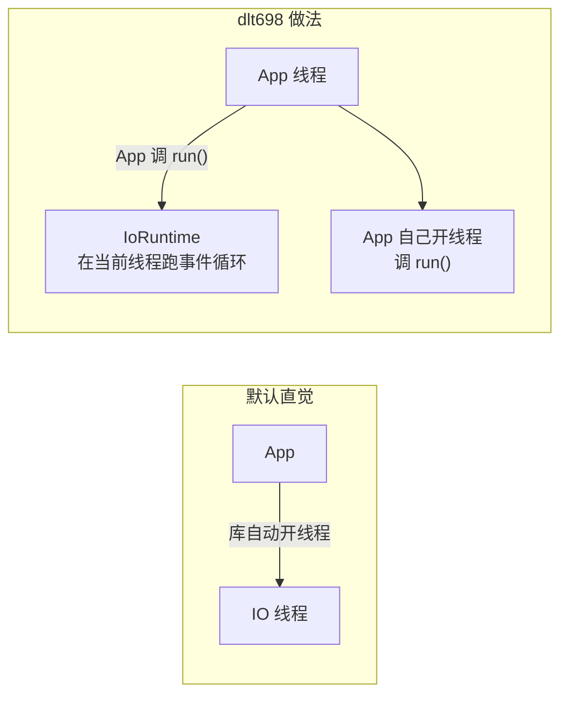
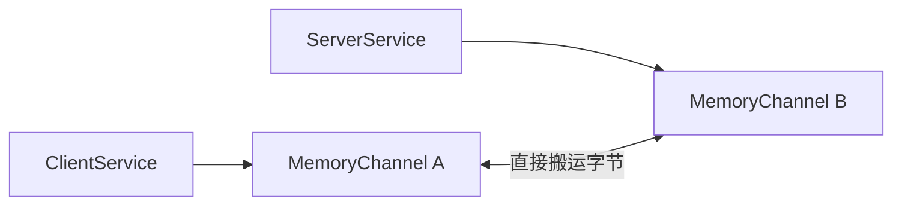

# 传输层

传输层是**唯一可选的一层**。关掉 `DLT698_BUILD_TRANSPORT`，其余八层全部照常工作。

它回答的问题只有一个：字节从哪来、到哪去。

## IChannel：唯一的抽象

```cpp
/** @brief 异步字节流通道接口及完成回调类型。 */
class DLT698_API IChannel {
    virtual ~IChannel() = default;
    virtual void async_read(ReadHandler handler) = 0;
    virtual void async_write(Bytes bytes, WriteHandler handler) = 0;
    virtual void close() = 0;
};
```

只有三个方法，而且都是异步的。这个接口足够小，所以可以轻松实现：

| 实现 | 用途 |
| --- | --- |
| `TcpChannel` | 真实 TCP 连接 |
| `SerialChannel` | 原始串口字节读写 |
| `SerialLinkChannel` | 串行时序适配层 |
| `MemoryChannel` | 确定性协议模拟 |

**没有同步方法。** 这是个有意的决定——一旦提供 `read()` 同步接口，每个上层都要处理「同步还是异步」两套逻辑，复杂度翻倍。整库统一异步，同步需求由 [对象服务层的 SyncClientService](./service.mdx) 在上层解决。

`async_write` 是**接管缓冲区**（move）而非拷贝：

```cpp
virtual void async_write(Bytes bytes, WriteHandler handler) = 0;
```

参数是 `Bytes`（`vector<uint8_t>`）按值传入，意味着所有权转移。省掉一次拷贝，语义也更清晰。

**「每个通道最多允许一个在途读取」** 这条约束保证了实现可以只有一个读缓冲区。

## IoRuntime：应用驱动，不建线程

```cpp
/** @brief 由应用调用的 run/run_for 驱动的 I/O 运行时，不创建内部工作线程。 */
class IoRuntime {
    DLT698_API void run();
    DLT698_API void run_for(std::chrono::milliseconds duration);
    DLT698_API void stop();
    DLT698_API void finish();
    DLT698_API void restart();
};
```

这是传输层最值得注意的设计：**`IoRuntime` 不创建任何内部工作线程**。



好处是**线程数量完全由应用决定**。想用一个线程跑整个程序就 `run()`，想用线程池里的一格就自己开线程调用 `run_for()`。

如果库自动开线程，会带来几个实际问题：线程数不可控、退出时不知如何等待、嵌入式环境可能根本不允许创建线程。

`finish()` 和 `stop()` 的区别：

| 方法 | 行为 |
| --- | --- |
| `stop()` | 请求事件循环停止，让 `run` 尽快返回 |
| `finish()` | 释放空闲守卫，让 `run` 在所有排队任务和异步操作**完成后**自然返回 |

`stop()` 是「立即停」，`finish()` 是「做完手上的事再停」。优雅关闭用 `finish()`，强制中断用 `stop()`。

`IoRuntime` 同样不可复制——它内部持有事件循环，复制会得到两个共享状态的循环。

## TCP

```cpp
/** @brief 由应用驱动的异步 TCP 运行时、连接通道及监听器。 */
```

`TcpListener` 支持监听和接受连接，`TcpChannel` 表示一个已建立的连接。

有一个特殊入口：**双向拨号**。`dlt698_master` 和 `dlt698_terminal` 两个示例程序分别扮演主站和终端，都主动拨号对方，用于验证**协议角色与拨号方向相互独立**。

这不是多此一举。RS-485 总线上主站主动发起，TCP 场景下也可能两端都需要主动连接。「谁是主站」是协议角色，「谁拨号」是传输行为——**这两件事在标准里是分开的**，测试就要能分别验证。

## 串行链路时序

这是 698 串行通信最麻烦的部分，也是最容易被忽略的。

```cpp
/** @brief 为每帧加四个 FE，保留至少 33 位时间的收发间隔。 */
class SerialLinkChannel final : public IChannel {
    DLT698_API static std::shared_ptr<SerialLinkChannel> wrap(
        std::shared_ptr<IChannel> raw, /* ... */);
};
```

### 为什么需要适配层

串口和 TCP 的差别不只是「一个串口一个 TCP」：

| 问题 | 说明 |
| --- | --- |
| 前导 FE | 每帧前加四个 `0xFE` 让对端同步 |
| 帧间隔 | 收发之间至少保留 33 位时间 |
| 方向切换 | RS-485 半双工需要控制收发方向 |

如果把这些逻辑塞进 `SerialChannel`，这个类就同时承担了「字节读写」和「协议时序」两个职责。拆成 `SerialLinkChannel` 之后——

> **`SerialLinkChannel` 可以在内存通道上验证。**

这是它最大的价值。串行时序是纯粹的逻辑，不依赖真实硬件，所以可以写一个 `MemoryChannel` 当底层，在测试里精确验证「FE 加了几个」「间隔够不够」。真实串口的硬件时序问题，则留给硬件测试。

### 为什么是「四个 FE」

规约规定帧前导是四个 `0xFE`。这个数字不是随便定的——它给接收方提供足够的采样时间来锁定波特率。

写成五个或三个在某些设备上也能工作，但**这不是可以为了兼容性而偏离的地方**。按标准来。

### 接收不剥离 FE

```cpp
/** @brief 读取原始字节并记录最近接收时间，不剥离接收 FE。 */
```

注意注释：接收时**不剥离** FE。

剥离 FE 是链路层流解析的工作——`FrameStreamDecoder` 本来就要跳过前导和噪声。如果传输层先剥离，等于做了链路层的活，两处都做就会出问题。

传输层的职责到「把字节原样交出去」为止。

## MemoryChannel

```cpp
/** @brief 用于确定性协议模拟的有界内存字节通道。 */
```

这是整个库能写出确定性测试的关键。

它让**整条协议栈跑在内存里**：



不需要 socket，不需要串口，不需要设备。所有 `service`、`session`、`app` 层的测试都建立在它上面。

**有界**是必须的：无界的内存通道在测试里会掩盖问题。真到现场换成 TCP，一个不受控的对端就能把内存耗尽。

示例程序里有一批「对象服务层（无需设备）」的例子——`dlt698_memory_get`、`dlt698_memory_mutation`、`dlt698_standard_points`、`dlt698_standard_records`——全部跑在内存通道上。它们既是示例，也是可执行的文档。

## 关闭传输后

```sh
cmake -S . -B build -DDLT698_BUILD_TRANSPORT=OFF
```

关掉之后：

| 能力 | 状态 |
| --- | --- |
| TCP 客户端 / 监听 | 不可用 |
| 原始串口 | 不可用 |
| 内存通道 `MemoryChannel` | ✅ 可用 |
| `SerialLinkChannel`（配内存通道） | ✅ 可用 |
| 会话、同步/异步服务 | ✅ 可用 |
| 编解码、链路分帧 | ✅ 可用 |

这个开关的实际价值是**测试可以在没有网络栈的环境里跑**——受限的 CI 容器、精简的交叉编译环境、离线开发机。

`transport_tcp` 和 `app` 两个测试可执行文件带 `network` 标签，需要真实回环 socket，可以单独筛出来：

```sh
ctest --test-dir build -L network --output-on-failure
```

## 一个已修复的坑

传输实现统一启用 Asio 线程支持后，遇到过 MinGW 下因**头文件包含顺序不同**而混用「有线程」和「无线程」类型的静态链接崩溃。

问题的本质是 Asio 的类型在两种编译配置下 ABI 不一致。只要有一个编译单元用了不同的 `ASIO_SEPARATE_COMPILATION` 或 `ASIO_NO_TS_EXECUTORS` 设置，链接就会出问题，而且报错信息完全不提 Asio，很有迷惑性。

解决办法是**强制所有编译单元使用统一配置**。这类问题无法靠改代码绕过，只能从构建配置上消除可能性。

上游是 [会话层](./session.mdx)，下游是 [链路层](./link.mdx)。